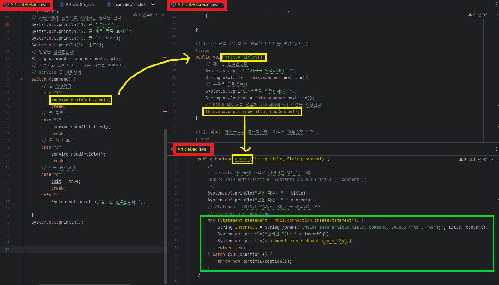

# JDBC 사용법

- 데이터베이스는 파일의 형태로 데이터를 효율적으로 저장하기 위한 프로그램
- Java 가 데이터베이스와 소통할 수 있도록 해주는 API

### Build
Java Development Kit ( JDK )
- Java를 개발하기 위한 도구 모음집
- Java 언어를 Java Bytecode로 변환하는 **컴파일러 (javac)**

### Build Automation Tool

Gradle & Maven
- Build Automation Tool
- Java 프로젝트를 빌드하는데 사용되는 대표적인 도구
- 소스코드 컴파일, 단위 테스트 , 버전관리 , JAR 생성 . . .
- JAR 파일 : 배포를 위해 Java Class 를 부수 정보와 함께 압축하는 형태

### Dependency Management
프레임워크나 라이브러리(의존성)을 사용한다.
- 다른 개발자가 이미 만들어 놓은 것을 활용한다.
- 해당 라이브러리 코드도 우리가 가져와 설정해야 한다.
- Maven 과 Gradle 은 인터넷에 연결되어 있으면 , **라이브러리를 자동으로 가져온다.**

```build.gradle
dependencies {
    runtimeOnly '~~~'
    implementation '~~~'
    ...
}
```
# Statement & ResultSet

### JDBC

Java에서 직접적으로 사용하는 건 JDBC API.
- JDBC 는 데이터 베이스와 소통하기 위한 드라이버가 필요하다.
- 드라이버를 관리해주는 클래스가 DriverManager

## Statement
SQL 을 전달하는데 사용할 수 있다 !
- DriverManager 한테 받은 Connection 객체를 활용
- execute() 메서드로 SQL 쿼리 실행
```java
    // 1. 어떤 데이터베이스에 연결할지를 String로 작성
    String connectionString = "jdbc:sqlite:db.sqlite";
    
    
    // 2. 해당 데이터베이스에 연결
    try (Connection connection = DriverManager.getConnection(connectionString)) {
        System.out.println("Connection Success ! ");
        
        // 3. 데이터 베이스 연결 객체로부터 Statement 객체를 받는다.
        Statement statement = connection.createStatement();
        // 4. execute 를 이용해 간단한 SQL 문을 사용한다.
        statement.execute("""
        CREATE TABLE user(
            id INTEGER PRIMARY KEY AUTOINCREMENT
        );
        """);
    } catch (SQLException e) {
        System.out.println(e.getErrorCode());
        System.out.println(e.getMessage());
        throw new RuntimeException(e);
    }
```

```java
// Update
String updateSql = """
    UPDATE user
    SET first_name = 'dukong'
    WHERE id = 1;
""";
// executeUpdate 는 내가 실행한 SQL문의 결과로 바뀐 줄의 갯수를 반환한다.
int rows = statement.executeUpdate(updateSql);
System.out.println("rows affected : " + rows);

```

## ResultSet
SELECT의 결과를 ResultSet 객체로 반환
- `next()` : 결과 테이블의 다음 줄로
- `get{type}()` : type형으로 컬럼 데이터를 회수하기 위해 사용

```java
// Select
String selectSql = """
SELECT * FROM user WHERE id = 1;
""";
// 조회하는 쿼리는 ResultSet으로 데이터를 받는다.
// ResultSet은 결과 테이블을 살펴볼 수 있게 도와주는 interface
ResultSet resultSet = statement.executeQuery(selectSql);
if (resultSet.next()){
    System.out.println(resultSet.getString("username"));
    System.out.println(resultSet.getString("first_name"));
    System.out.println(resultSet.getString("email"));
}
// 다음 줄이 없으면 next() 는 false 반환
else {
    System.out.println("Could not find");
}
```

## Article 예제
```java
public class ArticleMain {
    public static void main(String[] args) {
        System.out.println("게시글 작성하기 1.");
        // 게시글은 제목과 내용으로 구성되어 있다.


        // 1. 사용자는 반복해서 명령을 입력한다.
        // 1-1. 사용자가 1을 입력하면, 게시글을 작성하는 메뉴를 선택한 것.
        // 1-2. 사용자가 2를 입력하면, 작성된 게시글의 제목을 전부 나열하는 메뉴를 선택한 것.
        // 1-3. 사용자가 3을 입력하면, 게시글 상세보기 메뉴를 선택한 것.
        // 1-4. 사용자가 q를 입력하면, 프로그램 종료 (main 메서드의 끝에 도달하는 것)

        // 사용자는 반복해서 게시글을 작성할 수 있다.
        // ArticleSimple class 생성
        List<ArticleSimple> articles = new ArrayList();
        Scanner scanner = new Scanner(System.in);

        // 사용자가 종료를 원하는 flag
        boolean quit = false;
        while (!quit) {
            // 사용자에게 선택지를 제시하는 출력을 한다.
            System.out.println("1. 글 작성하기");
            System.out.println("2. 글 제목 목록 보기");
            System.out.println("3. 글 하나 보기");
            System.out.println("q. 종료");
            // 명령을 입력받는다.
            String command = scanner.nextLine();
            // 사용자의 입력에 따라 다른 기능을 실행한다.
            // if-else : 상세한 조건
            // switch : 특정한 데이터가 있을 때
            switch (command) {
                // 글 작성하기
                case "1" :
                    // 제목을 입력받는다.
                    System.out.println("제목을 입력하세요: ");
                    String newTitle = scanner.nextLine();
                    System.out.println("본문을 입력하세요: ");
                    String newContent = scanner.nextLine();
                    // 게시글 목록에 저장한다.
                    ArticleSimple newArticle =
                            new ArticleSimple(newTitle, newContent);
                    articles.add(newArticle);
                    break;
                // 글 목록 보기
                case "2" :
                    // 모든 글을 순회할 것인데,
                    // 사용자가 하나 보기에서 어떤 숫자를 넣을지를 판단할 수 있게
                    // 하기 위해, i를 같이 출력해준다.
                    for (int i = 0; i < articles.size(); i++) {
                        ArticleSimple article = articles.get(i);
                        // '번호. 제목' 형태로 출력 준비
                        String output = String.format("%d. %s", i, article.getTitle());
                        // 출력
                        System.out.println(output);
                    }
                    break;
                // 글 하나 보기
                case "3" :
                    System.out.println("글 번호를 선택하세요: ");
                    // 사용자에게 몇 번 글을 볼 건 지 입력 받고,
                    String idxString = scanner.nextLine();
                    int idx = Integer.parseInt(idxString);
                    // 해당 글을 가져와서
                    ArticleSimple article = articles.get(idx);

                    // 제목 : {제목}
                    // 내용 : {내용}
                    // 의 형태로 출력한다.
                    System.out.println(String.format("제목: %s", article.getTitle()));
                    System.out.println(String.format("내용: %s", article.getContent()));
                    break;
                // 반복 종료하기
                case "q" :
                    quit = true;
                    break;
                default:
                    System.out.println("잘못된 입력입니다.");

            }
            System.out.println();
        }
    }
}
```

이 길고 긴 코드를 main 에서만 쓰는데 클래스를 나누어 정리해주려고 한다 !
### Statement 활용해 DB 연결
```java
public ArticleDBService(Scanner scanner) {
this.scanner = scanner;
try {
    // 데이터베이스에 연결해서,
    Connection connection = DriverManager.getConnection("jdbc:sqlite:db.sqlite");
    // DAO로 넘겨준다.
    this.dao = new ArticleDao(connection);
} catch (SQLException e) {
    throw new RuntimeException(e);
}

}
```
### switch -> service

switch문 안에 있는 메서드를 ArticleDBService클래스로 나누어 준다
```java
public class ArticleDBService {

    // 1. 게시글을 작성할 때 필요한 데이터를 일단 입력받자
    public void writeArticles() {
        // 제목을 입력받는다.
        System.out.print("제목을 입력하세요: ");
        String newTitle = this.scanner.nextLine();
        // 본문을 입력받는다.
        System.out.print("본문을 입력하세요: ");
        String newContent = this.scanner.nextLine();
        // DAO에 데이터를 전달해 데이터베이스에 작성을 요청한다.
        this.dao.create(newTitle, newContent);
    }

    // 2. 작성된 게시글들을 출력할건데, 아직은 아무것도 안함 .
    public void showAllTitles() {
        List<ArticleDto> articles = this.dao.readAll();
        // 데이터베이스에서 회수한 데이터를 하나씩 출력한다.
        for(ArticleDto article : articles) {
            System.out.println(String.format("%d. %s", article.getId(),article.getTitle()));
        }
    }


    // 3. 하나의 게시글의 정보를 출력하는 메서드
    public void readArticle() {
        System.out.println("글 번호를 선택하세요: ");
        String idxString = this.scanner.nextLine();
        int idx = Integer.parseInt(idxString);
        ArticleDto article = this.dao.readOne(idx);
        System.out.println();
        System.out.println(String.format("제목: %s", article.getTitle()));
        System.out.println(String.format("내용: %s", article.getContent()));
    }

```
Service에 있는 메서드를 main 에서 간단하게 써줄 수 있다 .

```java

// 새 ArticleDBService 를 만든다.
ArticleDBService service = new ArticleDBService(scanner);

        // 명령을 입력받는다.
        String command = scanner.nextLine();
        // 사용자의 입력에 따라 다른 기능을 실행한다.
        // service 를 이용하여 .
        switch (command) {
        // 글 작성하기
        case "1" :
        service.writeArticles();
        break;
        // 글 목록 보기
        case "2" :
        service.showAllTitles();
        break;
        // 글 하나 보기
        case "3" :
        service.readArticle();
        break;
        // 반복 종료하기
        case "q" :
        quit = true;
        break;
        default:
        System.out.println("잘못된 입력입니다.");

        }
    System.out.println();
}
```

`List<ArticleSimple> articles = new ArrayList(); ` Article를 표현하기 위한 클래스를 생성해준다 

### ArticleDto 
Article클래스에 들어가는 title, content 와 생성자,  getter , setter를 만들어준다.
```java
public class ArticleDto {
    private Integer id;
    private String title;
    private String content;

    public ArticleDto(Integer id, String title, String content) {
        this.id = id;
        this.title = title;
        this.content = content;
    }

    public Integer getId() {
        return id;
    }

    public void setId(Integer id) {
        this.id = id;
    }

    public String getTitle() {
        return title;
    }

    public void setTitle(String title) {
        this.title = title;
    }

    public String getContent() {
        return content;
    }

    public void setContent(String content) {
        this.content = content;
    }
}
```
Service 클래스에 사용자가 작성한 데이터를 담기위한 리스트를 생성해준다.
```java
    // 사용자가 작성한 데이터를 담기위한 리스트
    private final List<ArticleMem> articles;

    // 일을 할 준비단계
    public ArticleService(Scanner scanner) {
        this.scanner = scanner;
        this.articles = new ArrayList<>();
    }

```
DB에 저장하기 위해 DB를 다루는 DAO를 생성해준다.

```java
public class ArticleDao {
    // 어떤 데이터베이스와의 연결을 나타내는 connection
    private final Connection connection;

    public ArticleDao(Connection connection) {
        this.connection = connection;
    }

    // 제목과 내용을 전달받으면
    // 데이터베이스에 새로운 게시글(article) 행을 만들고,
    // 성공 여부에 따라서 boolean을 반환한다.
    public boolean create(String title, String content) {
        /*
        -- article 테이블에 새로운 데이터를 넣어주는 SQL
        INSERT INTO article(title, content) VALUES ('title', 'content');
         */
        System.out.println("받은 제목: " + title);
        System.out.println("받은 내용: " + content);
        // Statement: JDBC에 전달하는 SQL문을 전달하는 역할
        // try - with - resources
        try (Statement statement = this.connection.createStatement()) {
            String insertSql = String.format("INSERT INTO article(title, content) VALUES ('%s', '%s');", title, content);
            System.out.println("준비된 SQL: " + insertSql);
            System.out.println(statement.executeUpdate(insertSql));
            return true;
        } catch (SQLException e) {
            throw new RuntimeException(e);
        }
    }


    // 데이터베이스에 저장된 모든 글 정보를 List 형태로 반환한다.
    public List<ArticleDto> readAll() {
        /*
        -- article 테이블의 모든 데이터를 반환하는 SQL
        SELECT * FROM article;
         */

        System.out.println("모든 데이터 조회하기");
        try (Statement statement = this.connection.createStatement()) {
            String selectSql = "SELECT * FROM article;";
            ResultSet resultSet = statement.executeQuery(selectSql);
            // 여러개의 데이터를 돌려줄 예정이니,
            List<ArticleDto> articles = new ArrayList<>();

            // ResultSet 은 .next() 메서드를 통해 다음 줄을 확인하며,
            // 만일 다음 줄이 없으면 , .next() 의 결과는 false다
            while (resultSet.next()) {
                /*
                System.out.println(resultSet.getInt("id"));
                System.out.println(resultSet.getString("title"));
                System.out.println(resultSet.getString("content"));
                */

                // resultSet의 데이터를 바탕으로 새로운 ArticleDto 객체를 만들자.
                ArticleDto article = new ArticleDto(
                        resultSet.getInt("id"),
                        resultSet.getString("title"),
                        resultSet.getString("content")
                );
                articles.add(article);
            }
            return articles;
        } catch (SQLException e) {
            throw new RuntimeException(e);
        }
    }

    // PreparedStatement
    // 조회하고 싶은 게시글을 받고, 그 게시글을 객체의 형태로 반환하는 메서드
    public ArticleDto readOne(int id) {
        System.out.println("단일 데이터 조회하기");
        /*
        -- 특정 id인 article 행 조회
        SELECT * FROM article WHERE id = %d;
         */

        // PreparedStatement 는  SQL를 먼저 준비
        String selectSql = "SELECT * FROM article WHERE id = ?;";
        try (PreparedStatement statement = connection.prepareStatement(selectSql)){
            statement.setInt(1,id);
            // 결과는 동일하게 ResultSet으로 받는다.
            ResultSet resultSet = statement.executeQuery();
            // ResulteSet을 사용한다.
            if (resultSet.next()) {
                return new ArticleDto(
                        resultSet.getInt("id"),
                        resultSet.getString("title"),
                        resultSet.getString("content")
                );
            }
        } catch (SQLException e){
            throw new RuntimeException(e);
        }
        // 지금은  null 이지만 나아가면 Optional 사용 가능
        return null;
    }
```
## 클래스를 나누고 Statement를 활용하여 DB에 연결하기
### EX) 데이터 넣기
- Main.java 에서 service.writeArticles() 를 만나면
- service.java의 writeArticles() 메서드가 실행된다.
- writeArticles() 메서드의 dao.reate(newTitle, newContent)를 만나면
- dao.java의 create(String title, String content) 메서드가 실행되고
- statement 를 활용하여 JDBC에 SQL문을 전달한다.

### `그림으로  보는 순서도 `


### 예제
- [Article](Article)