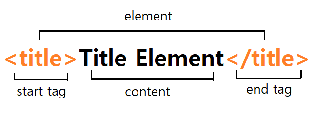

# HTML

## HTML
- HyperText Markup Language
- 구조를 표현하기 위한 언어
- Markdown과 역할이 유사

기초적인 HTML 문서
- 브라우저가 작성된 내용을 읽고, 내용을 보여준다.


### HTML 요소



- 요소 (element) : html을 이루는 단위   
- 태그(tag) : html 요소를 정의한다. 여는 태그 , 닫는 태그로 짝 이룸   
- 내용(content) : html 요소가 담고있는 정보가 작성되는 부분

### 요소, element
- 중첩해서 가능
- 계층적 구조 표현
```html
<html>
    <head>
    </head>
    <body>
    </body>
</html>
```
- <>꺽새괄호 닫는 태그 잊지 말자 !!! 

