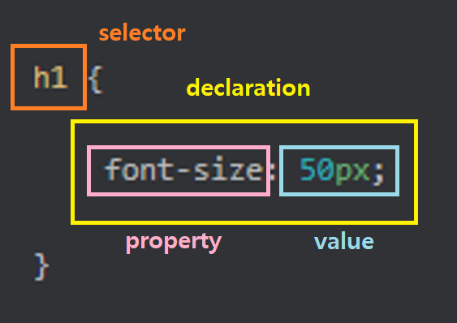
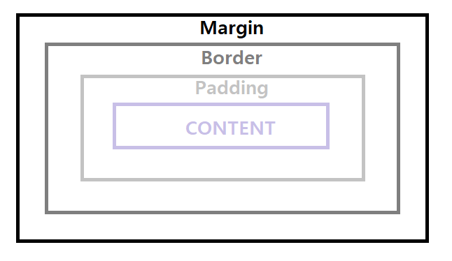

# CSS

- Cascading Style Sheets
- 표현 , 즉 스타일 (색, 글씨체, 크기 등) 을 표현하기 위한 언어
- 어떤 요소가 어떻게 보일지를 정의한다.

## CSS 문법
어떤 요소를 선택해서 어떻게 변경 할 지를 선언한다.
- 선택자(Selector) : 어떤 요소에 적용할 지
- 선언(Declaration) : 속성과 값을 정의
- 속성(Property) : 어떤 표현을 변경할 지 
  - 글씨체 , 크기, 색상 등
- 값(Value) : 속성을 어떻게 변경할 지



## CSS 를 HTML 에 적용하는 3가지 방법
### 1. Inline CSS
- HTML 요소에 직접 표현하기
```html
<!-- 장점 : 빠르고 정확-->
<!-- 단점 : 무지하게 많이 반복-->
<h1 style="color: red;">Inline CSS</h1>

```
### 2. Internal (Embedded) CSS
- `<head>` 내부에 `<style>` 요소에 작성하기

```html
<!-- 장점 : CSS를 따로 관리하고 , HTML 전체에 적용 가능-->
<!-- 단점 : 웹사이트 페이지가 늘어나면 반복해서 head에 작성해줘야 함 -->
<head>
  <style>
    h2 {
      color: yellowgreen;
    }
  </style>
</head>
<body>
  <h2>Internal CSS</h2>
</body>
```
### 3. External CSS
- 외부 파일을 `<link>` 요소로 불러오기
```html
<head>
  <link rel="stylesheet" href="01-styles.css">
</head>
<body>
    <h3>External CSS</h3>
</body>
```
```css
// 01-styles.css 
h3 {
  color: blue;
}
```

## CSS Box Model
요소를 그릴 때 상자를 바탕으로 요소와 요소의 내용
다른 요소들을 어떻게 그릴 지 결정하는 방법



- content : 요소 내부의 내용
- padding : 테두리부터 요소의 내용까지의 공간
- border : 요소의 테두리
- margin : 요소의 테두리부터 외부의 요소와의 공간

