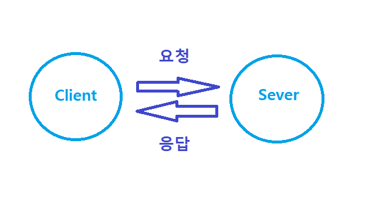

# 인터넷 과 웹 개발

### 인터넷이란 ?
- TCP/IP 통신을 기반으로 연결된 수많은 컴퓨터가 이루는 연결망(network)
- 연결된 컴퓨터들이 서로 정해진 규칙을 바탕으로 데이터를 주고 받는 것
- 인터넷 상에서 제공되는 서비스를 웹 서비스
- 이런 서비스를 개발하는 행위를 **웹 개발**

### Client - Server Model (or Architecture)

인터넷 브라우저에서 보는 페이지
- 브라우저는 서로 다른 많은 페이지를 우리에게 제공한다.
- > 인터넷을 통해 페이지를 달라고 요청 보내면 ,인터넷의 어떤 컴퓨터가 페이지를 응답해준다.

### Client 클라이언트
- 서비스 주세요 !!!
- 인터넷에 연결된 장치 혹은 소프트웨어 프로세스
- 서비스를 요청하는 주체

### Server 서버
- 서비스 여깄어 !!!
- 사용자에게 전송될 데이터( 웹 페이지 , 이미지 등) 또는 기능이 저장된 컴퓨터 또는 프로세스
- 요청에 대한 적당한 응답을 하는 주체

### 브라우저 주소창에 주소를 입력하면 ?
- 인터넷 어딘가에 있는 주소에 해당하는 컴퓨터에 요청을 보내고 
- 그에 대한 응답을 돌려받은 다음
- 사용자에게 응답을 적절하게 해석해 우리에게 보여준다

### Frontend & Backend

- 프론트엔드 개발자 : 상황에 맞는 데이터를 요구 , 제공된 데이터를 **사용자가 알아보기 쉽게 만드는 클라이언트에 집중**하는 개발자
- 백엔드 개발자 : 요청의 적합성 여부의 판단 , 요청에 따른 알맞는 **데이터를 가공 , 데이터 관리와 서버에 집중**하는 개발자

### HTML CSS JS

- [HTML](HTML.md) : 전달하고자 하는 데이터의 기본적인 구조를 나타낸다.
- [CSS](css.md) : 문서가 어떤 식으로 표현되어야 할 지 정의한다.
- JavaScript : 상황에 따라 HTML , CSS 를 조작해 페이지에 동작을 만든다.

