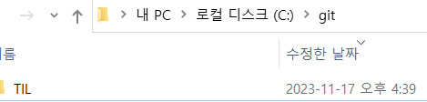
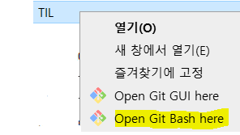
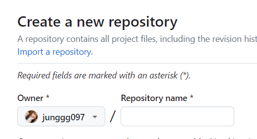
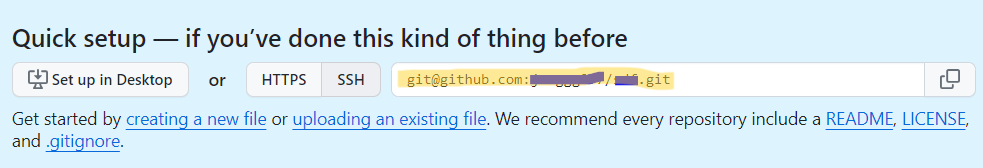

### 터미널에서 작업하는 기본적인 기능

## 사전작업

```
git config --global user.email "내 이메일"
git config --global user.name "내 이름"
```
- git : Git을 사용하는 명령어
- config : Git에 설정을 저장하겠다는 의미
- --global : 이 설정을 Git이 관리하는 프로젝트에 상관없이 사용한다는 의미
- user.email : 이 Git을 사용하는 사용자의 이메일 설정
- user.name : 이 Git을 사용하는 사용자의 이름 설정

  
## 버전 관리 시작

1. 프로젝트를 모아두는 폴더 생성  
    
    

2. 폴더 내부에서 Git으로 관리하고자 하는 프로젝트를 나타내는 새로운 폴더 ```TIL```  생성  

    

3. 폴더에서 우클릭  ```Open Git Bash here``` 이동

    


4. 열린 터미널에 ```git init``` 작성

-> ```TIL``` 폴더가 Git으로 관리되기 시작한다.  
정상적으로 작동하는 지 확인하기 위해 ```git status``` 명령


설치된 Git의 상태에 따라 ```on branch main``` , ``` on branch master``` 로 나올 수 있다.
  
### 명령어  

- ```git init``` :  Git을 이용해 현재 폴더를 Git으로 관리하기 시작한다.  
- ```git status``` : 현재 프로젝트의 상태를 나타낸다.    

현재 버전이 무엇인지, 어떤 변동사항을 기록할 예정인지 등의 상태


## Github에서 프로젝트 시작

1.  Github에서 Git Repository 만들기  

      
    
    New Repository 생성

2. 프로젝트를 컴퓨터로 가져오기  

     

    해당 주소를 복사하여 터미널에 실행 

    ```git clone <복사한 주소>```

    명령이 마무리 되면 , 폴더에 새로운 ```TIL``` 폴더 생성


- ```git clone <주소>``` : ```<주소>``` 에 저장된 프로젝트를 폴더로 가져온다. 이때, 명령어를 실행한 폴더에 해당 프로젝트 이름의 폴더가 추가로 생기고, 해당 폴더 내부에 프로젝트 코드가 들어간다.
  
- ```git@github.com:user_email/프로젝트이름.git```


## 컴퓨터 프로젝트를 Github으로 

터미널에서 Github에 올리고 싶은 프로젝트 폴더 이동 후   
```
git remote add origin <주소>
git push --set-upstream origin main 
```
명령을 진행하고 Github 페이지 새로고침


