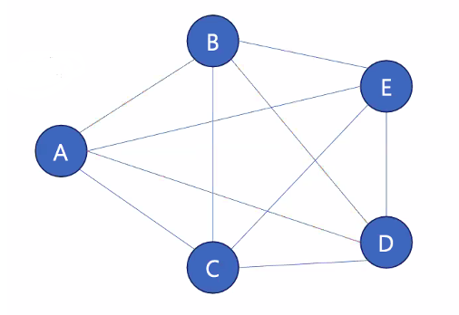

# Graph

아이템 (사물 or 추상적 개념) 들과 이들 사이의 연결 관계를 표현한 자료구조
- 정점(vertex)의 집합과 이들을 연결하는 간선(edge)로 구성
- 선형 자료구조나 트리로 표현하기 어려운 M:N 관계를 표현하기 위해 주로 사용

  

- 정점(Vertex) : 그래프의 데이터가 담긴 부분 [ 트리에선 노드(node) ]  
- 간선(Edge) : 정점간의 연결관계   
- 인접하다(Adjacent) : 정점과 정점을 연결하는 간선 존재   
- 차수(Degree) : 하나의 정점에 연결된 간선의 수   
- 경로(Path) : 정점을 통해 연결되는 간선들을 순서대로 나열한 것 ( A-B-D-E, A-B-D-A)

## 무향 & 유향 그래프

## 가중치 그래프 (Weighted Graph)

- 간선에 값이 추가된 형태
- 해당 간선을 택할 때 비용을 표현하는 경우
- A -> E 까지의 최단 비용 등

## 순환 그래프 

- 시작한 정점에서 끝나는 경로를 사이클이라 할 때 , 이런 순환 구조를 가진 그래프
- A-B-C
- 트리는 순환구조를 가지고 있는 그래프이다.

## 완전 그래프

- 정점들이 가능한 모든 간선을 가진 그래프

# Graph의 표현

## 인접 행렬

## 인접 리스트

인접 행렬은 비워져있어야 하는 곳은 0으로 남겨줘야하지만   
인접 리스트는 인접한 정점들만 리스트로 남겨둔다.