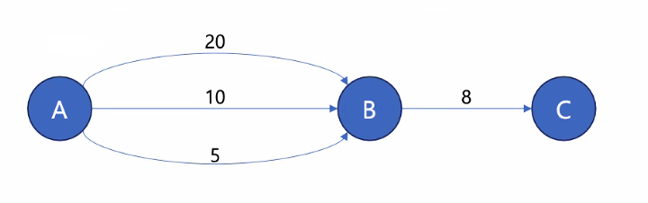
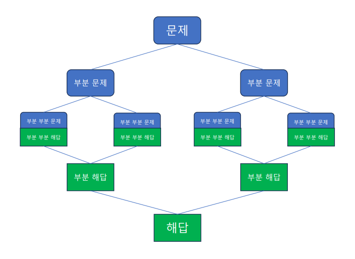

# Dijkstra Algorithm
유향 가중치 그래프에서, 하나의 시작 정점에서 그래프의 다른 정점들로 도달하는 **최단 경로**를 찾는 알고리즘
  
  
A - > C 까지의 거리를 구하려면 ? . . .
- A -> B 거리
- B -> C 거리

### 방법
1. 시작 정점을 결정하고 , 시작 정점과 그래프의 다른 모든 정점 사이의 거리를 무한으로 초기화 (시작 정점까지의 거리는 0)
2. 아직 방문하지 않은 정점 중 현재 도달 가능한 가장 가까운 정점 방문 (첫 방문은 시작 정점)
3. 방문한 정점에서 도달 가능한 주변 정점들까지의 거리 갱신
    - **현재 정점까지 최단 거리 + 주변 정점까지의 거리와**
    - **현재 기록된 주변 정점까지의 거리 중 작은 것**
4. 모든 정점을 방문할 때까지 2 ~ 3 반복

# Divide & Conquer
분할 정복 알고리즘 : 큰 문제를 나눠 풀고, 그 결과를 조합해 문제 해결하는 알고리즘 기법
- 분할(Divide) : 해결할 문제를 여러개의 작은 문제로 나눈다.
- 정복(Conquer) : 작은 단위의 문제를 해결한다.
- 조합(Merge or Combine) : 해결한 작은 단위 문제들을 합해 원래 문제의 답을 구한다.



### 하노이의 탑
```java
public class Prob11729 {
    private static StringBuilder towerBuilder = new StringBuilder();

    public static void main(String[] args) throws IOException {
        BufferedReader reader = new BufferedReader(new InputStreamReader(System.in));
        // 원판의 갯수
        int n = Integer.parseInt(reader.readLine());
        // pow 가 double을 반환하기때문에 앞에 int 붙혀줌
        // 점화식을 이용해 이동횟수를 먼저 넣어준다.
        towerBuilder.append((int)(Math.pow(2,n) - 1)).append('\n');
        hanoi(n, 1,3,2);
        System.out.println(towerBuilder);
    }

    private static void hanoi (
            // 하노이의 탑의 높이
            int height,
            // 현재 출발하고자 하는 기둥
            int start,
            // 목표로 하는 기둥
            int end,
            // 제 3의 기둥
            int other
    ) {
        // 높이가 1이라면 , start -> end로 이동시키면 된다.
        if (height == 1) {
            towerBuilder.append(start + " " + end + '\n');
        }

        // 높이가 2 이상이면 ?
        else  {
            // 1. 한 단계 아래 높이의 원반들을 other로 이동한다.
            hanoi(height-1,start,other,end);
            // 2. 제일 아래 원반을 end로 이동한다.
            towerBuilder.append(start + " " + end + '\n');
            // 3. other에 이동된 한단계 아래 높이의 원반들을 end로 이동한다.
            hanoi(height-1,other,end,start);
        }

    }
}
```
## 병합 정렬
분할 정복 기법을 이용한 대표적 정렬 알고리즘

정렬되지 않은 배열이 있을 때,  
- 배열을 두 개의 동일한 크기의 배열로 나눈다.
- 각 배열에 원소가 하나가 남을 때까지 반복한다.
- 나눠진 배열을 2개씩 정렬하면서 하나의 배열로 병합한다.