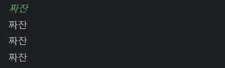
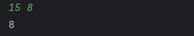
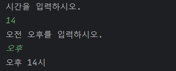
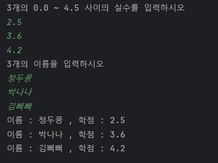

# 예제

### 1. 사용자에게 입력을 받고, 동일한 내용을 세번 출력하는 코드를 작성하시오.

```java
        Scanner scanner = new Scanner(System.in);
        String scannedLine = scanner.nextLine();
        System.out.println(scannedLine);
        System.out.println(scannedLine);
        System.out.println(scannedLine);
```
#### 실행화면  



2. 두개의 숫자를 입력받고, 순서를 바꿔서 출력하시오.
```java
        Scanner scanner = new Scanner(System.in);
        int scannerInt1 = scanner.nextInt();
        int scannerInt2 = scanner.nextInt();
        System.out.println(scannerInt2);
        System.out.println(scannerInt1);
```
#### 실행화면



## 3. 해당 그림을 출력하는 코드를 만들어 보시오.
               *   *
              *** ***
             *********
             *********
               *****
                 *

 
```java
System.out.print("  *   *\n" + " *** ***\n" + "*********\n" + "*********\n" + "  *****\n" + "    *\n");
```
#### 실행화면


## 4. 시간과 오전 오후를 입력받고, 오전 XX시 의 형식으로 출력하는 코드를 작성하시오.
```java
        Scanner scanner = new Scanner(System.in);
        
        System.out.println("시간을 입력하시오.");
        int time = scanner.nextInt();

        System.out.println("오전 오후를 입력하시오.");
        String ampm = scanner.next();
        String msgTemplate = "%s %d시";

        System.out.println(String.format(msgTemplate, ampm, time));

```
#### 실행화면




## 5. 사용자에게 3개의 0.0 ~ 4.5 사이의 실수를 입력받고 그 뒤에 3개의 이름을 입력받은 뒤
   이름 - <이름>, 학점 - <실수> 의 형태로 3줄을 출력하는 프로그램을 작성하시오. 단, 실수의 범위가 틀려도 상관없다.

```java
        Scanner scanner = new Scanner(System.in);

        System.out.println("3개의 0.0 ~ 4.5 사이의 실수를 입력하시오");
        float[] scores = new float[3];
        scores[0] = scanner.nextFloat();
        scores[1] = scanner.nextFloat();
        scores[2] = scanner.nextFloat();

        System.out.println("3개의 이름을 입력하시오");
        String[] names = new String[3];
        names[0] = scanner.next();
        names[1] = scanner.next();
        names[2] = scanner.next();

        System.out.println("이름 : " + names[0] + " , 학점 : " + scores[0]);
        System.out.println("이름 : " + names[1] + " , 학점 : " + scores[1]);
        System.out.println("이름 : " + names[2] + " , 학점 : " + scores[2]);
```
#### 실행화면


