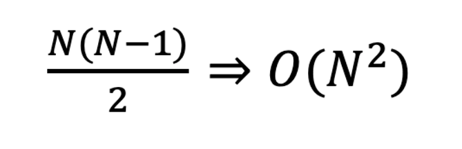

# Sorting

## Bubble Sort
인접한 두 자료를 비교하며 자리를 교환하는 방식  
제일 **오른쪽에** 큰 수 정렬)
- 첫번째 원소, 두번째 원소를 비교한다.  
만약 첫 번째 원소가 두 번째 원소보다 크다면 , 둘 자리를 교환한다.
- 마지막 원소까지 비교와 교환이 완료되면 , 두 번째 원소부터 다시 똑같은 작업을 반복한다.  
  
```java

// 인접한 두 원소를 비교하면서
// 더 큰 원소를 오른쪽으로 차레대로 이동
// 배열 개수 n
// n - 1 만큼 반복

    public static void bubbleSort(int[] array){
        // 자주 사용하는 변수
        int length = array.length;
        for (int i = 0; i < length - 1; i ++) {
            for (int j = 0; j < length - 1; j++ ){
                // j와 j + 1 을 비교한다.
                if (array[j] > array[j+1]) {
                    // 더 크면 교환
                    int temp = array[j];
                    array[j] = array[j +1];
                    array[j+1] = temp;
                }
            }
        }
    }

    public static void main(String[] args) {
        int[] array = { 36, 12, 18, 15, 41, 19};
        bubbleSort(array);
        System.out.println(Arrays.toString(array));
    }

```

```java
// 실행 결과
round0 : [12, 18, 15, 36, 19, 41]
round1 : [12, 15, 18, 19, 36, 41]
round2 : [12, 15, 18, 19, 36, 41]
round3 : [12, 15, 18, 19, 36, 41]
round4 : [12, 15, 18, 19, 36, 41]
[12, 15, 18, 19, 36, 41]

```

### Bubble Sort 시간 복잡도
한 번 작업을 거치면 제일 오른쪽 끝에 가장 큰 숫자가 정렬된다.
- 첫 번째 단계에서는 n-1 번의 비교(교환)가 일어난다.
- 두 번째 단계에서는 n-2 번의 비교(교환)가 일어난다.
- n - 1 단계까지 반복하며 , 마지막엔 1번의 비교(교환)가 일어난다.

  
  
## Selection Sort

주어진 자료 중 제일 작은 숫자를 골라서 **앞으로** 정렬하는 방식
- 자료 전체를 확인해 제일 작은 값을 찾아 , 제일 앞의 원소와 교환한다.  
이 과정이 끝나면 제일 앞의 원소는 정렬이 끝난다.
- 이후 정렬되지 않은 원소들을 기준을 같은 작업을 정렬이 안된 원소가 없을 때까지 반복한다.  

버블 정렬과 다르게 작은 숫자부터 하나씩 앞에서부터 정렬이 된다 .

```java

// 가장 작은 원소를 찾아서
// 가장 앞의 원소랑 교환하는 과정 반복
    public static void selectionSort(int[] array){
        int length = array.length;

        for ( int i = 0; i < length- 1 ; i ++) {
            // 현재 정렬되지 않은 제일 앞쪽 원소는 i
            int minIndex = i;
            // array의 원소 중 최솟값이 어디있는지를 찾는다.
            for (int j = i + 1; j < length; j++) {
                if (array[j] < array[minIndex]) {
                    minIndex = j;
                }
            }
            // 제일 작은 원소와 제일 앞의 원소를 교환한다.
            int temp = array[minIndex];
            array[minIndex] = array[i];
            array[i] = temp;
            System.out.println("round" + i + " : " + Arrays.toString(array));
        }
    }

public static void main(String[] args) {
        int[] array = { 11,31,29,16,20,1,5,8};
        selectionSort(array);
        System.out.println(Arrays.toString(array));

        }
```

```java
// 실행 결과
round0 : [1, 31, 29, 16, 20, 11, 5, 8]
round1 : [1, 5, 29, 16, 20, 11, 31, 8]
round2 : [1, 5, 8, 16, 20, 11, 31, 29]
round3 : [1, 5, 8, 11, 20, 16, 31, 29]
round4 : [1, 5, 8, 11, 16, 20, 31, 29]
round5 : [1, 5, 8, 11, 16, 20, 31, 29]
round6 : [1, 5, 8, 11, 16, 20, 29, 31]
[1, 5, 8, 11, 16, 20, 29, 31]
```
  
### Selection Sort 시간 복잡도
한 번 작업을 거치면 제일 왼쪽 끝에 가장 작은 숫자가 정렬된다.
- 첫 번째 단계에서는 n - 1 번의 비교가, 마지막엔 1 번의 비교가 일어난다.
- 시간 복잡도 계산은 Bubble Sort랑 동일하다
- 하지만 Selection Sort 의 경우 실제 데이터가 교환되는 횟수가 Bubble Sort 보다 적다.
    

## Counting Sort
각 자료가 몇 개가 존재하는 지를 정리한 뒤 그 정보를 활용해 정렬하는 방식
- 먼저 자료들의 값의 범위 만큼의 공간을 가진 **counts배열**을 만든다.
- 자료의 각 data를 확인하여, counts[data] 의 값을 하나 더해준다.
- 이 과정이 끝나면 counts[data]에는 data가 몇 개인지가 저장된다.
- 첫 번째 원소부터 시작하여 counts 배열의 앞쪽 원소의 값을 뒤해 합해준다.
- 이후 본래의 자료 data를 순회하여, counts 배열에 따라 결과를 정리한다.
  
```java
public static void countingSort(int[] array){
        // 원래는 max 를 찾아야 되는데
        // 이번만큼은 5임을 알고있다고 가정해본다.
        int[] counts = new int[6];
        // 모든 array 데이터를 순회하면서 각 counts[data]++;
        for (int data : array) {
            counts[data]++;
        }
        // counts 배열을 각 데이터가 마지막에 나오는 위치에 담기게 조정
        for (int i = 0; i < 5; i++) {
            // 다음칸에 지금칸의 데이터를 담아준다.
            counts[i +1] += counts[i];
        }
        // counts 중간점검
        System.out.println(Arrays.toString(counts));

        // 결과를 담을 배열 만들기 (output)
        int[] output = new int[array.length];
        // 뒤에서부터 순회하며 output 배열 채우기.
        for ( int i = array.length - 1; i >= 0; i--){
            // 현재 원소의 마지막 위치를 조정
            counts[array[i]]--;
            // 현재 데이터의 다음 위치 정보를 회수
            int position = counts[array[i]];
            // 새로운 배열의 position에 데이터 넣기
            output[position] = array[i];
        }

        // 원본에 새로운 데이터 적용하기
        for ( int i = 0; i < array.length; i++) {
            array[i] = output[i];
        }
        // 이렇게도 사용 가능
        // System.arraycopy(output, 0 , array, 0, array.length);

    }
```
```java
//실행 화면
[0, 0, 1, 1, 2, 3, 4, 4, 5, 5]
```

### Counting Sort 시간 복잡도
자료의 갯수(N)와 자료의 값의 범위(최댓값 K) 에 동시에 영향을 받는다.
- counts 배열을 만들기 위해 전체 자료를 살펴봐야 한다. (N)
- counts 배열을 누적합 하는 과정에서 counts 배열을 전체를 살펴봐야 한다. (K)
- 다시 전체 자료를 순회하며 결과 배열을 만든다. (N)  
  
