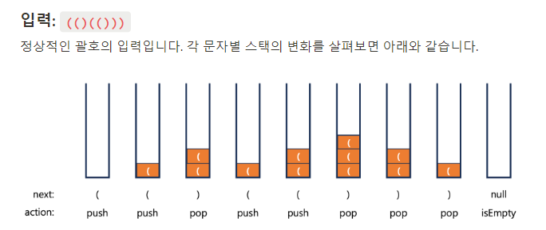

# Stack
- 괄호 검사
- Depth First Search

## Stack
물건을 쌓아올린 형태의 자료구조
- 자료가 일렬로 놓인 선형 자료구조
- 마지막에 추가된 자료가 먼저 나오는 **후입선출** 자료구조 ( LIFO : Last in First Out) 

### 기본 기능
- Stack 에 데이터를 추가  (push)
- Stack 에서 데이터 회수  (pop)
- Stack 이 비어있는 지 확인 (isEmpty, empty)
- Stack 의 제일 위의 데이터 확인
- Stack 이 가득 차 있는 지 확인
  
```java
// int 데이터를 스택의 형태로 관리할 수 있는 클래스
public class MyStack {
    // 배열로 실제 데이터 보관
    private final int[] arr = new int[16];
    // 데이터를 얼마나 채워넣었는지
    private int top = -1;

    // 데이터 넣기
    // x를 스택의 제일 위에 넣는다.
    public void push(int x) {
        if (top == arr.length - 1) {
            throw new RuntimeException("stack is full");
        }
        this.top++;
        arr[this.top] = x;
    }

    // 데이터 회수
    // 스택의 제일 위의 데이터를 꺼낸다.
    public int pop() {
        if (this.isEmpty()) {
            throw new RuntimeException("stack is empty");
        }
        // 제일 위에 있는 데이터
        int value = arr[this.top];
        // 스택의 제일 위칸을 줄여준다.
        this.top--;
        return value;
    }

    // 비어있는지 확인
    public boolean isEmpty() {
        return this.top == -1;
    }

    public static void main(String[] args) {
        MyStack intStack = new MyStack();
        intStack.push(10);
        intStack.push(15);
        intStack.push(20);
        System.out.println(intStack.isEmpty());

        System.out.println(intStack.pop());
        System.out.println(intStack.pop());
        System.out.println(intStack.pop());
        System.out.println(intStack.isEmpty());
    }
}

```
```java
// 실행 결과
false ( 비어 있지 않기 때문에 )
20 ( LIFO 이기 때문에 20부터 POP)
15
10
true ( 데이터가 다 회수 되었기 때문에 )
```

## Call Stack
프로그래밍 언어의 함수 호출 및 복귀 순서 관리
- 함수 또는 메소드의 호출 시 마지막 수행 위치를 Stack에 저장
- 호출된 함수가 종료 시 마지막 수행 위치로 복기하기 위해 Stack 에서 pop 한다.
  

## 괄호 검사
문자열의 문자를 하나씩 조사한다.
1. 여는 괄호가 나올 경우 스택에 `push`
2. 닫는 괄호가 나올 경우 
   - 스택이 비어있으면 → `false`
   - 아닐 경우 `pop`
3. 모든 입력이 끝났을때 → `return isEmpty()`
  
  
  
마지막 입력 후 ```isEmpty```를 호출했을 때, 스택이 비어있으므로 정상적인 입력이다.
  
### 소괄호 검사
```java

//괄호 테스트
public class ParTest {
  public static void main(String[] args) {

    // target 이 맞는 괄호 조합인지 확인하고 싶다.
    String target = "(()((())))";
    Stack<Character> charStack = new Stack<>();
    // pop에 실패했다를 기록하는 용도
    boolean success = true;

    // 1. target 의 각 글자를 확인한다.
    for (int i = 0; i < target.length(); i++) {
      char next = target.charAt(i);
      // 2. 여는 괄호를 만나면 push
      if (next == '(') {
        charStack.push(next);
      }

      // 3.  닫는 괄호를 만나면 , 상황에 따라 pop을 하는데,
      else  {
        // 3-1. stack이 비어있다 == 정당한 괄호가 아니다.
        if (charStack.empty()) {
          System.out.println("NO");
          success = false;
          break;
        }
        // 3-2. stack이 비어있지 않으면 pop
        else charStack.pop();
      }
    }

    // 4. 문자열 내부 글자를 다 확인했으면 ,
    if (charStack.empty() && success) {
      System.out.println("YES");
    }
    else {
      System.out.println("NO");
    }
  }
}

```
   main에서는 짧게 작성하게 **메서드 추출 형태**로 !!! 뽑아 낼 수 있다.  

```java
//괄호 테스트
public class ParTest {

    // boolean으로 메서드 추출 형태
    // 메서드 추출 형태
    public static boolean test(String target) {
        Stack<Character> charStack = new Stack<>();
        // 1. target의 각 글자를 확인한다.
        for (int i = 0; i < target.length(); i++) {
            char next = target.charAt(i);
            // 2. 여는 괄호를 만나면 push
            if (next == '(') {
                charStack.push(next);
            }
            // 3. 닫는 괄호를 만나면, 상황에 따라 pop을 하는데,
            else {
                // 3-1. stack이 비어있다 == 정당한 괄호가 아니다.
                if (charStack.empty()) {
                    // 결과는 false다
                    return false;
                }
                // 3-2. stack이 비어있지 않으면 pop
                else charStack.pop();
            }
        }
        // 4. 문자열 내부 글자를 다 확인했으면, 스택이 비어있는지가 답이다.
        return charStack.empty();
    }
    

    public static void main(String[] args) {
        System.out.println(test("(()()(()))()"));
        System.out.println(test("(()((()))()()))"));
        System.out.println(test("((()))()()"));
    }
}
```  
