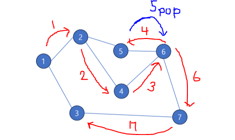

# Stack
- [괄호 검사](#괄호-검사)
- [Depth First Search](#depth-first-search)

## Stack
물건을 쌓아올린 형태의 자료구조
- 자료가 일렬로 놓인 선형 자료구조
- 마지막에 추가된 자료가 먼저 나오는 **후입선출** 자료구조 ( LIFO : Last in First Out) 

### 기본 기능
- Stack 에 데이터를 추가  (push)
- Stack 에서 데이터 회수  (pop)
- Stack 이 비어있는 지 확인 (isEmpty, empty)
- Stack 의 제일 위의 데이터 확인
- Stack 이 가득 차 있는 지 확인
  
```java
// int 데이터를 스택의 형태로 관리할 수 있는 클래스
public class MyStack {
    // 배열로 실제 데이터 보관
    private final int[] arr = new int[16];
    // 데이터를 얼마나 채워넣었는지
    private int top = -1;

    // 데이터 넣기
    // x를 스택의 제일 위에 넣는다.
    public void push(int x) {
        if (top == arr.length - 1) {
            throw new RuntimeException("stack is full");
        }
        this.top++;
        arr[this.top] = x;
    }

    // 데이터 회수
    // 스택의 제일 위의 데이터를 꺼낸다.
    public int pop() {
        if (this.isEmpty()) {
            throw new RuntimeException("stack is empty");
        }
        // 제일 위에 있는 데이터
        int value = arr[this.top];
        // 스택의 제일 위칸을 줄여준다.
        this.top--;
        return value;
    }

    // 비어있는지 확인
    public boolean isEmpty() {
        return this.top == -1;
    }

    public static void main(String[] args) {
        MyStack intStack = new MyStack();
        intStack.push(10);
        intStack.push(15);
        intStack.push(20);
        System.out.println(intStack.isEmpty());

        System.out.println(intStack.pop());
        System.out.println(intStack.pop());
        System.out.println(intStack.pop());
        System.out.println(intStack.isEmpty());
    }
}

```
```java
// 실행 결과
false ( 비어 있지 않기 때문에 )
20 ( LIFO 이기 때문에 20부터 POP)
15
10
true ( 데이터가 다 회수 되었기 때문에 )
```

## Call Stack
프로그래밍 언어의 함수 호출 및 복귀 순서 관리
- 함수 또는 메소드의 호출 시 마지막 수행 위치를 Stack에 저장
- 호출된 함수가 종료 시 마지막 수행 위치로 복기하기 위해 Stack 에서 pop 한다.
  

## 괄호 검사
문자열의 문자를 하나씩 조사한다.
1. 여는 괄호가 나올 경우 스택에 `push`
2. 닫는 괄호가 나올 경우 
   - 스택이 비어있으면 → `false`
   - 아닐 경우 `pop`
3. 모든 입력이 끝났을때 → `return isEmpty()`
  
  
  
마지막 입력 후 ```isEmpty```를 호출했을 때, 스택이 비어있으므로 정상적인 입력이다.
  
### 소괄호 검사
```java

//괄호 테스트
public class ParTest {
  public static void main(String[] args) {

    // target 이 맞는 괄호 조합인지 확인하고 싶다.
    String target = "(()((())))";
    Stack<Character> charStack = new Stack<>();
    // pop에 실패했다를 기록하는 용도
    boolean success = true;

    // 1. target 의 각 글자를 확인한다.
    for (int i = 0; i < target.length(); i++) {
      char next = target.charAt(i);
      // 2. 여는 괄호를 만나면 push
      if (next == '(') {
        charStack.push(next);
      }

      // 3.  닫는 괄호를 만나면 , 상황에 따라 pop을 하는데,
      else  {
        // 3-1. stack이 비어있다 == 정당한 괄호가 아니다.
        if (charStack.empty()) {
          System.out.println("NO");
          success = false;
          break;
        }
        // 3-2. stack이 비어있지 않으면 pop
        else charStack.pop();
      }
    }

    // 4. 문자열 내부 글자를 다 확인했으면 ,
    if (charStack.empty() && success) {
      System.out.println("YES");
    }
    else {
      System.out.println("NO");
    }
  }
}

```
   main에서는 짧게 작성하게 **메서드 추출 형태**로 !!! 뽑아 낼 수 있다.  

```java
//괄호 테스트
public class ParTest {

    // boolean으로 메서드 추출 형태
    // 메서드 추출 형태
    public static boolean test(String target) {
        Stack<Character> charStack = new Stack<>();
        // 1. target의 각 글자를 확인한다.
        for (int i = 0; i < target.length(); i++) {
            char next = target.charAt(i);
            // 2. 여는 괄호를 만나면 push
            if (next == '(') {
                charStack.push(next);
            }
            // 3. 닫는 괄호를 만나면, 상황에 따라 pop을 하는데,
            else {
                // 3-1. stack이 비어있다 == 정당한 괄호가 아니다.
                if (charStack.empty()) {
                    // 결과는 false다
                    return false;
                }
                // 3-2. stack이 비어있지 않으면 pop
                else charStack.pop();
            }
        }
        // 4. 문자열 내부 글자를 다 확인했으면, 스택이 비어있는지가 답이다.
        return charStack.empty();
    }
    

    public static void main(String[] args) {
        System.out.println(test("(()()(()))()"));
        System.out.println(test("(()((()))()()))"));
        System.out.println(test("((()))()()"));
    }
}
```  

## Depth First Search
길이 우선 탐색
한쪽 갈림길을 택하면서 갈 수 있는 최대한 깊이 들어가면서 그래프 탐색
- 더이상 갈 곳이 없을 때까지 길을 따라간다.
- 막다른 길 나오면 ,마지막으로 갈림길이 나왔던 지점으로 돌아간다.
- 마지막 지점으로 => 후입선출 (LIFO) => 스택


```
1. 방문한 점에서 도달할 수 있는 점들을 살펴보고, 아직 방문하지 않은 점들의 정보를 스택에 push한다.
2. 스택에서 점의 정보를 pop하여 방문한다. 이후 다시 1번으로 돌아간다.
3. 스택이 빌때까지 반복한다.

정점들의 갯수와 간선 정보가 주어졌을 때,

1. 1번 정점에서 출발
2. 작은 숫자를 가진 정점부터 방문
  
의 조건을 가정하고, DFS 코드 작성
```
```java
package day3;

import java.util.ArrayList;
import java.util.List;
import java.util.Stack;

public class DepthFirstSearch {
    public static void main(String[] args) {
            String[] edges = {
                    "1 2",
                    "1 3",
                    "2 4",
                    "2 5",
                    "3 7",
                    "4 6",
                    "5 6",
                    "6 7"
            };
            // 총 점의 갯수
            int nodeCount = 7;
            // 각 점이 연결되었는지를 판단하기 위한 배열
            int[][] adjMap = new int[nodeCount + 1][nodeCount + 1];

            // 주어진 연결 정보를 바탕으로 adjMap을 채워넣는다. 연결 되어 있다면 1
            // 1. 주어진 선의 갯수만큼 반복
            for (int i = 0; i < edges.length; i++) {
                // 2. 하나의 정보를 나누어서 출발 종점을 구분해 각각 변수에 할당
                String[] edgeInfo = edges[i].split(" ");
                int leftNode = Integer.parseInt(edgeInfo[0]);
                int rightNode = Integer.parseInt(edgeInfo[1]);
                // 3. 각각의 정점의 adjMap[left][right] = 1
                adjMap[leftNode][rightNode] = 1;
                adjMap[rightNode][leftNode] = 1;
            }

        // 다음 방문할 곳을 기록하기 위한 스택 하나
        Stack<Integer> toVisit = new Stack<>();
        // 방문한 순서를 살펴보기 위한 리스트 하나
        List<Integer> visitOrder = new ArrayList<>();
        // 내가 방문했는 지를 파악하기 위한 배열 하나
        boolean[] visited = new boolean[nodeCount + 1];

        //DFS 시작
        // 1. 가장 먼저 방문할 곳을 넣어둔다.
        toVisit.push(1);
        // 2. 스택이 빌 때까지 (더 이상 방문할 곳이 없을 때까지) 반복한다.
        while (!toVisit.empty()) {
            // 3. 다음 방문할 곳을 pop한다.
            int next = toVisit.pop();
            // 4. 방문했는 지를 visited 를 바탕으로 파악해서 ,
            // 만약 방문했다면 다음 곳으로 넘어간다.
            if( visited[next]) continue;
            // 미방문이면 이제 표시한다.
            visited[next] = true;

            // 5. 방문 순서를 기록해준다.
            visitOrder.add(next);

            // 6. 다음 방문 대상을 스택에 push한다.
            for (int i = nodeCount; i > 0; i--) {
                // 만약 방문했다면 (visited[i]) 초기화하지 않고.
                if (visited[i] == true) continue;

                // 도달할 수 있다면 추가한다.
                if (adjMap[next][i] == 1 ) {
                    toVisit.push(i);
                }
            }

        }

        // 방문 순서 확인
        System.out.println(visitOrder);
    }

}

// 실행 결과
[1, 2, 4, 6, 5, 7, 3]

// 가장 먼저 방문할 곳에 따라 결과 달라진다

```

