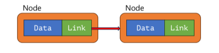
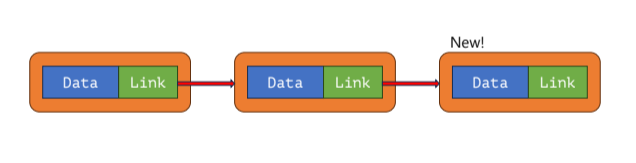
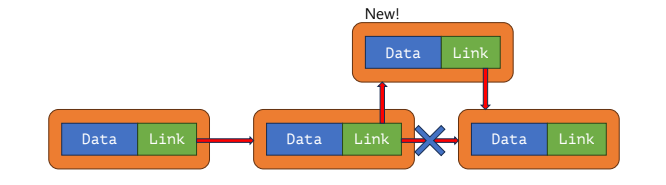
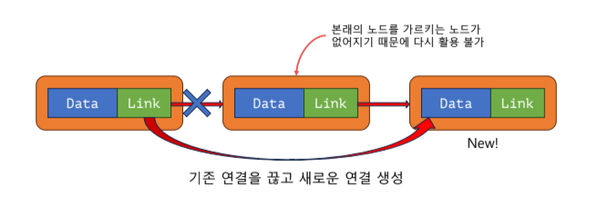
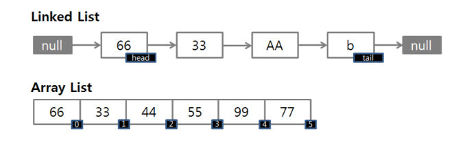

# LinkedList

## LinkedList -> 연결 리스트


- 데이터를 끝에 추가할 때 :
   1. 먼저 새로운 노드를 생성
  2. 연결 리스트의 마지막 노드의 `link` ( 다음 노드를 가르키는 참조 ) 를 새로운 노드로 설정  



  
- 데이터를 중간에 추가할 때 :
  1. 먼저 새로운 노드를 생성
  2. 삽입하려는 위치의 바로 전 노드의 `link` 를 새로운 노드로 설정
  3. 새로운 노드의 `link` 를 본래 삽입 위치에 있던 노드로 설정  

  

- 데이터를 중간에 제거할 때 :
    1. 제거하려는 노드 찾기
    2. 제거하려는 노드의 바로 전 노드의 `link` 를 제거할 노드의 다음 노드로 설정

  
* Queue를 사용할 때에는 Queue 인터페이스가 존재한다 .  
* LinkedList를 통해 활용한다.
  
### Interface Queue<T>
- enQueue -> add(), offer()
- deQueue -> remove(), poll()
- peek -> element(), peek()
- **add(), remove, element() -> 예외 발생**
- <span style = 'background-color:#ffdce0'>**offer(), poll(), peek() -> false, null 반환**</span> 


  
### LinkedList & ArrayList
  

  
- 데이터를 추가할 때
  - LinkedList : 노드만 추가하면 되기 때문에 동적으로 크기 조절이 수월함
  - ArrayList : 데이터를 추가할 때 내부 배열이 너무 작으면 데이터 전체를 복사
  
- 데이터를 조회할 때
  - LinkedList : 연결된 노드를 거쳐야 정확한 데이터가 조회 가능
  - ArrayList : 위치를 알면 바로 조회 가능
  
```java
// ArrayList와 LinkedList 의 상황에 따른 성능 비교
public class ListComparison {
    public static void main(String[] args) {
        //테스트를 위한 리스트 두개
        List<String> arrayList = new ArrayList<>();
        List<String> linkedList = new LinkedList<>();

        System.out.println("ArrayList 실행");
        rearInsert(arrayList);
        frontrInsert(arrayList);
        getElement(arrayList);

        System.out.println("linkedList 실행");
        rearInsert(linkedList);
        frontrInsert(linkedList);
        getElement(linkedList);
    }

    //데이터를 뒤쪽에 10000개 넣고,
    public static void rearInsert(List<String> list){
       long start = System.nanoTime();
        for (int i = 0; i <10000 ; i++) {
            list.add("hello");
        }
        long end = System.nanoTime();
        System.out.println(String.format("순차적 추가 소요시간: %15d ns",end - start));

    }
    //데이터를 앞쪽에 10000개 넣고,
    public static void frontrInsert(List<String> list){
        long start = System.nanoTime();
        for (int i = 0; i <10000 ; i++) {
            list.add(0,"hello");
        }
        long end = System.nanoTime();
        System.out.println(String.format("앞쪽에 추가 소요시간: %15d ns",end - start));
    }

    //각 데이터를 순서 기준으로 조회(get)
    public static void getElement(List<String> list){
        long start = System.nanoTime();
        for (int i = 0; i <list.size() ; i++) {
            list.get(i);
        }
        long end = System.nanoTime();
        System.out.println(String.format("아이템 조회 소요시간: %15d ns",end - start));
    }
}
```
```java
// 실행 결과
ArrayList 실행
        순차적 추가 소요시간:          744900 ns
        앞쪽에 추가 소요시간:        21787800 ns
        아이템 조회 소요시간:         2452000 ns
        LinkedList 실행
        순차적 추가 소요시간:         2326700 ns
        앞쪽에 추가 소요시간:         3446500 ns
        아이템 조회 소요시간:       189840600 ns
```
 -> 데이터의 추가 제거가 빈번하다 ? => **"LinkedList"** 사용   
 -> 데이터의 위치에 기반한 조회가 빈번하다 ? => **"ArrayList"** 사용