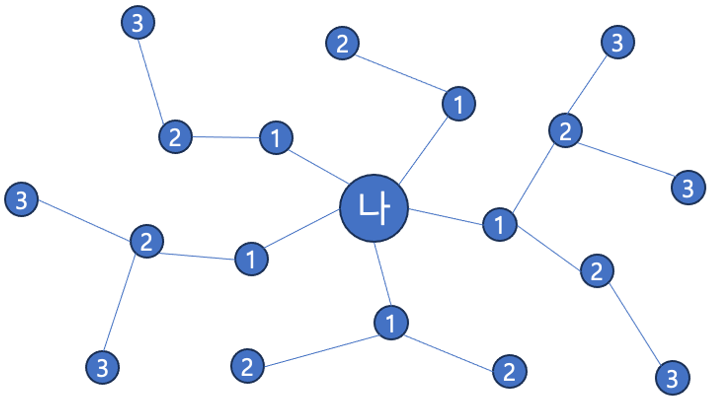

# 너비 우선 탐색 ( BFS - Breadth First Search )

- 현재 상태에서 `직접적인 연관 관계` 에 있는 모든 정보를 먼저 확인한다
- 깊이 우선 탐색과 매우 유사하게 구현
-  차이점은 !! 스택 대신 큐를 사용한다.  

  
1. 방문한 점에서 도달할 수 있는 점들을 살핀다,.
    1-A. 아직 방문하지 않은 점들은 큐에 enQueue 한다.
2. 큐에서 점의 정보를 deQueue 하고 방문한다. 이후 다시 1번으로 돌아간다.
3. 큐가 빌 때까지 반복한다.
```java
public class BreadthFirstSearch {
    public static void main(String[] args) {
        String[] edges = {
                "1 2",
                "1 3",
                "2 4",
                "2 5",
                "3 7",
                "4 6",
                "5 6",
                "6 7"
        };
        // 총 점의 갯수
        int nodeCount = 7;
        // 각 점이 연결되었는지를 판단하기 위한 배열
        int[][] adjMap = new int[nodeCount + 1][nodeCount + 1];

        // 주어진 연결 정보를 바탕으로 adjMap을 채워넣는다. 연결 되어 있다면 1
        // 1. 주어진 선의 갯수만큼 반복
        for (int i = 0; i < edges.length; i++) {
            // 2. 하나의 정보를 나누어서 출발 종점을 구분해 각각 변수에 할당
            String[] edgeInfo = edges[i].split(" ");
            int leftNode = Integer.parseInt(edgeInfo[0]);
            int rightNode = Integer.parseInt(edgeInfo[1]);
            // 3. 각각의 정점의 adjMap[left][right] = 1
            adjMap[leftNode][rightNode] = 1;
            adjMap[rightNode][leftNode] = 1;
        }

        //1번에서 출발해서, 모든 점들을 방문할 때, 어떤 순서로 방문하는지
        // 다음 방문할 곳을 기록하기 위한 큐 하나,
        Queue<Integer> toVisit = new LinkedList<>();
        //방문한 순서를 살펴보기 위한 리스트 하나,
        List<Integer> visitOrder = new ArrayList<>();
        //내가 방문했는지를 파악하기 위한 배열 하나
        boolean[] visited = new boolean[nodeCount +1];

        //BFS 시작
        //1. 제일 먼저 방문할 곳을 넣어둔다.
        toVisit.offer(1);
        //2. 큐가 빌 때까지( 더이상 방문할 곳이 없을 때까지) 반복한다.
        while(!toVisit.isEmpty()){
            //3.다음 방문할 곳을 poll한다.
            int next = toVisit.poll();
            //4.방문 했는지를 visited를 바탕으로 파악해서,
            //만약 방문했다면 다음 곳으로 넘어간다.
            if(visited[next]) continue;
            //미방문이면 이제 표시한다.
            visited[next] = true;

            //5. 방문 순서를 기록해준다.
            visitOrder.add(next);
            //6. 다음 방문 대상을 큐에 offer한다.
            for (int i = 1; i <nodeCount+1 ; i++) {
                //만약 방문했다면(visited[i])추가하지 않고,
                if(visited[i]) continue; //바로 옆의 for을 스킵한다.
                //도달할 수 있다면 추가한다.
                if(adjMap[next][i] ==1){
                    toVisit.offer(i);
                }
            }
        }
        //방문순서 확인
        System.out.println(visitOrder);
    }
}


// 실행 결과
[1, 2, 3, 4, 5, 7, 6]

```