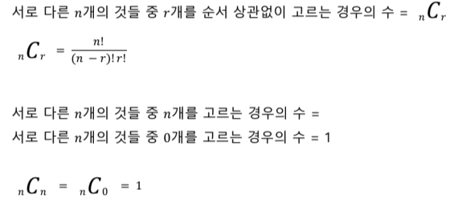

# 조합
- [for문 활용](#단순한-조합-제작---for-반복문-활용)
- [재귀함수 활용](#단순한-조합-제작---재귀함수-활용)
## 조합과 순열의 차이 ?
- 순열 : 서로 다른 n개의 것들 중 r 개를 **골라** 나열하는 법 
- 조합 : 서로 다른 n개의 것들 중 r 개를 **순서 상관없이** 고르는 법



### 단순한 조합 제작 - for 반복문 활용

```java
public class Combination {
    // n 개 중에서 3개를 선택하는 방법들을 출력하는 메서드
    // nC3 을 출력하는 메서드
    public static void combSimple(int n) {
        int first;
        int second;
        int third;
        // i는 0부터 n -2 까지 반복하고,
        for (int i = 0 ; i < n -2; i++) {
            first = i;
            //j는 i + 1부터 n -1 까지 반복하고,
            for (int j = first + 1; j < n - 1; j++) {
                second = j;
                // k 는  j + 1부터 n -1 까지 반복한다.
                for ( int k = second + 1; k < n; k++) {
                    third = k;
                    System.out.println(first + " " + second +" " + third);
                }
            }

        }
    }

    public static void main(String[] args) {
        combSimple(4);
    }
}
```
```java
// 실행 결과
0 1 2
0 1 3
0 2 3
1 2 3
```

### 단순한 조합 제작 - 재귀함수 활용

```java
// 재귀함수로 nCr 구하는 메서드
    public static void combRecurHelper(
            // 몇개(n) 중에서 몇 개(r)를 고를지
            int n, int r,
            // 여태까지 몇 개의 원소를 골랐는지
            int count,
            // 이번에 고를지 말지를 판단중인 숫자
            int next,
            // 조합 결과를 담을 배열
            int[] comb
    ) {

        // r 개 골라야 하는데 다 골랐다.
        if (count ==r ) {
            System.out.println(Arrays.toString(comb));
        }
        else if (next==n) {
            return;
        }
        else {
            // 만약 내가 이번에 next를 골랐다.
            comb[count] = next;
            // count 번째 원소를 골랐으니, count + 1 번째 원소를 고르러 가자.
            combRecurHelper(n,r,count+1,next+1,comb);
            // count 번째 원소를 고르지 않고, 다음 원소를 확인하자.
            combRecurHelper(n,r,count, next+1, comb);
        }

    }

    public static void combRecur(int n, int r) {
        combRecurHelper(n, r, 0,0, new int[r]);
    }
    public static void main(String[] args) {
        //combSimple(5);
        combRecur(5,3);
    }
```
```java
//실행 결과
[0, 1, 2]
[0, 1, 3]
[0, 1, 4]
[0, 2, 3]
[0, 2, 4]
[0, 3, 4]
[1, 2, 3]
[1, 2, 4]
[1, 3, 4]
[2, 3, 4]
```
- 순열처럼 모든 원소를 확인하지 않고
- 각각 원소의 선택 여부로 재귀를 진행한다