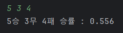
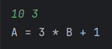
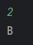
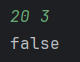
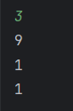
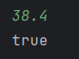

# 연산자 연습문제 

## H1
어떤 야구단의 승, 무승부, 패가 입력된다.
이 야구단의 승률 (승 / (승 + 패))를, 소숫점 세번째 자리 까지, 아래와 같이 출력하여라.
86승 2무 56패 승률: 0.606

```java
public class H1 {
    public static void main(String[] args) {
        Scanner scanner = new Scanner(System.in);
        
        int win = scanner.nextInt();
        int draw = scanner.nextInt();
        int lose = scanner.nextInt();
        double winRate =(double) win / (win + lose);
        
        System.out.println(String.format("%d승 %d무 %d패 승률 : %.3f",win,draw,lose,winRate));
        }
}
```

## H2
어떤 수 A와 B가 입력된다..
A를 B로 나눈 몫과 나머지를, "A = 몫 * B + 나머지"의 형태로 출력하여라.
예) A = 10, B = 3가 입력될때,
A = 3 * B + 1

```java
public class H2 {
    public static void main(String[] args) {
        Scanner scanner = new Scanner(System.in);
        int a = scanner.nextInt();
        int b = scanner.nextInt();

        System.out.println(String.format("A = %d * B + %d", a /b ,  a%b));
    }
}
```

## H3
ASCII 코드로 'A'는 65이다.
1 ~ 26 사이의 숫자 n이 입력될 때, n번째 알파벳을 대문자로 출력하여라.

```java
public class H3 {
    public static void main(String[] args) {
        Scanner scanner = new Scanner(System.in);

        int n = scanner.nextInt();
        //A == 65 이고 , n == 1 일때 출력이 'A'
        System.out.println((char) (64 + n));
    }
}

```

## H4
두 정수 A와 B가 입력될 때,
A가 B로 나누어 떨어지는지를 true 또는 false로 출력하여라.

```java
public class H4 {
    public static void main(String[] args) {
        Scanner scanner = new Scanner(System.in);

        int a = scanner.nextInt();
        int b = scanner.nextInt();
        System.out.println(a % b == 0);
    }
}
```

## H5
Scanner 이외의 변수를 한개만 선언하여
정수 A를 입력받아,
A^2, A^4, A^8의 1의 자리를 순서대로 한줄씩 출력하시오.

```java
public class H5 {
    public static void main(String[] args) {
        Scanner scanner = new Scanner(System.in);

        int base = scanner.nextInt();
        base *= base;
        base %= 10;
        System.out.println(base);
        base *= base;
        base %= 10;
        System.out.println(base);
        base *= base;
        base %= 10;
        System.out.println(base);
    }
}
```

## H6
바쁜 일정으로 컨디션이 안좋아져서,
체온이 38도 이상이거나 36도 이하일때는 병원에 가기로 했다.
체온을 입력받아서 병원에 가야할지를 true 또는 false로 출력하여라.
체온은 실수(double)로 주어진다.

```java
public class H6 {
    public static void main(String[] args) {
        Scanner scanner = new Scanner(System.in);

        double temperature = scanner.nextDouble();
        boolean goSeeDoctor = temperature <= 36 || temperature >=38;

        System.out.println(goSeeDoctor);
    }
}
```
