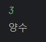
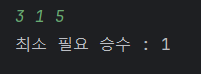
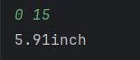
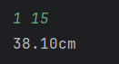
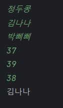
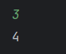

## H1
한 정수를 입력받아,
해당 정수가 음수인지 양수인지 아니면 0인지 출력하는 코드를 작성하여라.
```java
public class H1 {
    public static void main(String[] args) {

        Scanner scanner = new Scanner(System.in);
        int a = scanner.nextInt();

        if (a <  0) {
            System.out.println("움수");
        } else if (a > 0) {
            System.out.println("양수");
        } else {
            System.out.println("0");
        }
    }
}
```


## H2
축구리그에서는 승점을, 승리시 3점 무승부시 1점, 패배시 0점을 획득한다.  
남은 경기와 현재 승점과 목표 승점이 주어졌을 때,   
남은 경기에서 목표 승점을 넘을 수 있으면 필요한 최소 승수를
없으면 최고 승점을 출력하여라.
```java
public class H2 {
    public static void main(String[] args) {
        Scanner scanner = new Scanner(System.in);

        int remaining = scanner.nextInt();
        int current = scanner.nextInt();
        int goal = scanner.nextInt();
        // 넘을 수 있나를 판단하기 위해 전부 이겼다고 가정
        int maxScore = current + remaining * 3;
        // 목표 점수 넘었나 ?
        if (maxScore >= goal) {
            // 승 한번이 무승부로 바뀌면 최고점에서 몇 점이 줄까 ? 2점
            // 최고 점수 - 목표 점수 = 여유분 점수
            // 여유분 점수를 2로 나눈 몫만큼 덜 이겨도
            // 나머지를 다 무승부로 끝내면 필요한 최소 승수
            int minWins = remaining - (maxScore - goal) / 2;
            // 필요승수가 음수가 될 경우 0 으로 바꿔주는 삼항연산
            minWins = minWins < 0 ? 0 : minWins;
            System.out.println(String.format("최소 필요 승수 : %d", minWins));
        } else {
            System.out.println(String.format("최대 승점 : %d", maxScore));
        }
    }
}
```

- 남은 경기 3 , 현재 스코어 1 , 목표 점수 5 일 때, 남은 점수는 4점이다.
- 무승부 1 , 승 1 이면 필요한 최소 승소이기 때문에 최소 필요 승수는 1 이 나온다.

## H3
1인치는 2.54 센티미터이다.   
사용자에게 정수를 두개 입력받는다.   
첫번째 정수가 0이라면 두번째 정수는 센티미터이고,   
첫번째 정수가 1이라면 두번째 정수는 인치이다.  
센티미터는 해당 길이의 인치로, 인치는 해당 길이의 센티미터로 소수점 2째 자리까지 출력하여라.
```java
public class H3 {
    public static void main(String[] args) {
        Scanner scanner = new Scanner(System.in);

        // 첫 번째 정수는 단위
        int unit = scanner.nextInt();
        // 두 번째 정수는 길이
        int length = scanner.nextInt();

        // cm -> inch : / 2.54;
        if ( unit == 0) {
            System.out.println(String.format("%.2finch", length / 2.54));
        }
        // inch -> cm : * 2.54;
        else {
            System.out.println(String.format("%.2fcm", length * 2.54));
        }
    }
}
```
   

## H4
3명의 사람들에 대한 정보가  
개행문자로 구분된 이름(문자열)이 세번   
개행문자로 구분된 체온(정수)이 세번 입력된다.   
이 중 체온이 38도가 넘는 사람들의 이름을 출력하도록 한다.
```java
public class H4 {
    public static void main(String[] args) {

        Scanner scanner = new Scanner(System.in);
        // 이름을 담아둘 배열
        String[] names = new String[3];
        // 체온을 담아둘 배열
        int[] temps = new int[3];

        // 먼저 3번의 이름을 입력 받는다.
        for (int i = 0; i < 3; i++) {
            names[i] = scanner.nextLine();
        }

        // 3 번의 체온을 입력 받는다.
        for (int i = 0; i < 3; i++) {
            temps[i] = scanner.nextInt();
        }
        
        for (int i = 0; i <3; i++) {
            //38도가 넘으면
            if(temps[i] > 38) {
                //같은 위치의 이름을 출력
                System.out.println(names[i]);
            }
        }
    }
}
```

## H5
한 정수를 입력받는다.   
이후 이 정수를 거듭제곱하며 1의 자리를 확인하면서,   
몇번 거듭제곱 했을 때 다시 원래의 숫자의 1의 자리랑 일치하는지 출력하여라.   
한번만 거듭제곱해도 본래 숫자가 되면 결과는 1이다.
```java
public class H5 {
    public static void main(String[] args) {

        Scanner scanner = new Scanner(System.in);
        // 1의 자리만 확인해도 괜찮다
        // base 가 원래 1의 자리 ( 거듭제곱 할 때도 사용 )
        int base = scanner.nextInt() % 10;
        // 현재 얼마인지를 저장하기 위한 변수 ( 시작은 입력값 )
        int now = base;
        // 몇 번 반복했는지 세기 위한 변수
        int i = 0;
        // 결과가 나올 때까지 반복
        while (true) {
            // 거듭제곱 한다.
            now *= base;
            // 1의 자리만 남긴다.
            now %= 10;
            // 횟수를 증가시킨다.
            i++;
            // 종료조건 확인
            if ( now == base) {
                break;
            }
        }
         System.out.println(i);
    }
}
```  
  
3 ^ 1 = 3   
3 ^ 2 = 9   
3 ^ 3 = 27   
3 ^ 4 = 81   
3 ^ 5 = 243   
4 번 반복됨 

## H6
1.1월 1일의 요일과
2.2월 29일의 유무가 정수, 불린으로 주어진다.

이때 1월 1일의 요일은,
0 - 월요일, 1 - 화요일, 2 - 수요일, 3 - 목요일, 4 - 금요일, 5 - 토요일, 6 - 일요일

으로 입력된다.

각 달의 1일이 무슨 요일인지 1월부터 12월까지 순서대로 출력하는 코드를 작성하시오.
