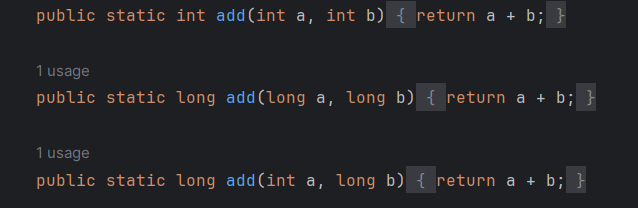

# Method

## 함수
- 독립적으로 실행될 수 있는 코드 조각

## 메서드
- 특정 클래스와 연결되어 그 클래스 객체에서 수행하는 기능


  

1. return type ( 반환 타입 )
    - 메서드의 결과를 반환하는 데이터의 자료형 

2. 이름 (식별자)
    - 메서드 이름 ( 메서드를 알아보기 쉽게 짓기 ! )
   
3. 매개변수 ( parameter )
    - 메서드에 전달할 데이터를 나타내는 변수
    - 괄호 사이에 , 로 구분
    - 자료형은 ...으로 사용 가능
    - 매개변수 필요 없는 메서드는 없어도 O

4. return
    - 메서드 결과 값을 반환하는 부분 

     
  
 

# Method Overloading



```java
결과값 : 5 /// add(intA, intB)
결과값 : 5 /// add(longA, longB)
결과값 : 5 /// add(intA, longB)
```

- 이름은 같은 , 매개변수 형태가 다른 메서드를 여러 개 만들 수 있다.
- 메서드 호출하는 코드에서 코드 활용도가 높아진다.


# Varargs
```java
      public static int varargAvg(int offset, int... ints) {
      int sum = 0;
      //사용은 배열 쓰듯이
      for ( int i = 0; i < ints.length; i++) {
         sum += ints[i];
      }
      return sum / ints.length;
    }
```

## 가변인자 - Variable-length argument lists

- 임의 갯수의 인자를 받을 수 있는 기능
- 메서드 내부에서 배열처럼 활용 가능
- int... = int[] 
- 가변인자와 다른 인자를 사용하고 싶으면 int offer, int... 처럼 가변인자를 나중에 넣어줘야 한다.

  

결과값  


