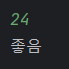
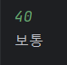
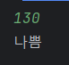
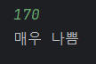
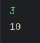
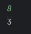
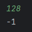
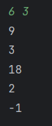
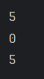
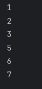

## H1
미세먼지 수치를 입력받고,   
0 ~ 30 이면 "좋음"  
31 ~ 80 이면 "보통"  
80 ~ 150 이면 "나쁨"  
151 ~ 이면 "매우 나쁨"
이라는 문자열을 반환하는 메서드를 작성하시오.
```java
public static String dustStatus(int dust){
        if (dust <= 30) {
            return "좋음";
        } else if (dust <= 80) {
            return "보통";
        } else if (dust <= 150) {
            return "나쁨";
        } else {
            return "매우 나쁨";
        }
    }

    public static void main(String[] args) {
        Scanner scanner = new Scanner(System.in);

        int dust = scanner.nextInt();

        System.out.println(dustStatus(dust));
    }
```
실행 결과 


## H2
현재 오전 7시이다.   
정수 n을 인자로 받아서,   
n 시간 후 12시까지 표기된 시계에서   
시침이 어떤 숫자 위에 있는지를 반환하는 메서드를 작성하시오.   
단, 입력이 0 <= n <= 127 를 벗어나면 -1을 반환하시오.

```java
public static int whatNum(int n) {
        // 입력 범위 초과
        if (n <0 || n > 127){
            return -1;
        }
        int now = 7;
        // 몇 시간이 지났나
        now += n;
        return now % 12 == 0 ? 12 : now % 12;
    }

    public static void main(String[] args) {
        Scanner scanner = new Scanner(System.in);
        int n = scanner.nextInt();
        System.out.println(whatNum(n));
    }
```
실행 결과  
오전 7시 + 3 = 10시  
  
오전 7시 + 8 = 15시 -> 3시  
  
조건 :  0 <= n <= 127 를 벗어나면 -1 반환  

## H3
사칙연산을 나타내는 문자(char) (+, -, *, /) 하나와 두개의 정수를 입력받아,   
각 기호에 대응하는 연산의 결과를 반환하는 메서드를 작성하시오.   
단, 정수 범위에서만 결과를 반환합니다.
```java
public static int calculate(char operator, int a, int b) {
        switch (operator){
        case '+':
        return a+b;
        case '-':
        return a-b;
        case '*':
        return a*b;
        case '/':
        return a/b;
        // default를 쓰거나

        }
        // 여기서 return을 한다.
        return -1;
        }

public static void main(String[] args) {
        Scanner scanner = new Scanner(System.in);
        int a = scanner.nextInt();
        int b = scanner.nextInt();

        System.out.println(calculate('+', a,b));
        System.out.println(calculate('-', a,b));
        System.out.println(calculate('*', a,b));
        System.out.println(calculate('/', a,b));
        System.out.println(calculate('\n',a,b));
        }
```
실행 결과  

## H4

int[]의 인자로

1.배열의 값들 중 최댓값의 위치를 반환하는 "maxWhere"
2.배열의 값들 중 최솟값의 위치를 반환하는 "minWhere"
3.배열의 값들 중 최댓값과 최솟값의 차이를 반환하는 "maxDiff"

메서드를 각각 작성하시오.
```java
public static int maxWhere(int[] numbers) {
        //numbers.length > 0 검증이 있으면 더 좋음
        // 초기 비교 대상
        int max = numbers[0];
        // 위치
        int index = 0;
        for (int i =0; i < numbers.length; i++){
            // 더 큰 애 발견
            if (numbers[i] > max) {
                // 정보 갱신
                max = numbers[i];
                index = i;
            }
        }
        // 반복이 끝나면 index 가 최댓값의 위치
        return index;

    }

    public static int minWhere(int[] numbers) {
        //numbers.length > 0 검증이 있으면 더 좋음
        // 초기 비교 대상
        // shift + f6 => 해당 변수 이름 전체 자동 변경 가능
        int min = numbers[0];
        // 위치
        int index = 0;
        for (int i =0; i < numbers.length; i++){
            // 더 작은 애 발견
            if (numbers[i] < min) {
                // 정보 갱신
                min = numbers[i];
                index = i;
            }
        }
        // 반복이 끝나면 index 가 최솟값의 위치
        return index;
    }

    public static int maxDiff(int[] numbers) {
        /* 이렇게 나눠서 해도 가능
        int maxIdx = maxWhere(numbers);
        int minIdx = minWhere(numbers);
        return numbers[maxIdx] - numbers[minIdx];
        */
        return numbers[maxWhere(numbers)] - numbers[minWhere(numbers)];
    }

    public static void main(String[] args) {
        int[] numbers = {1,2,3,4,5,6};
        System.out.println(maxDiff(numbers));
        System.out.println(minWhere(numbers));
        System.out.println(maxDiff(numbers));
    }
```
실행 결과    
maxDiff = 6 (i[5]) =>  5  
minWhere = 0 (i[0]) => 0  
maxDiff = 6 - 1 = 5 => 5  


## H5
int[]을 두개 받아,   
첫번째 배열의 마지막 원소 뒤에, 두번째 배열의 첫번째 원소가 오도록   
두 배열을 연결한 배열을 반환하는 메서드를 작성하시오.
```java
public static int[] concatArray(int[] front, int[] back) {

        int[] result = new int[front.length + back.length];
        // 1. 외부의 result 원소 순서용 변수 만들어서 for 두 번
        int idx = 0;
        for (int i = 0; i < front.length; i++) {
            result[idx]= front[i];
            idx++;
        }

        for (int i = 0; i < back.length; i++) {
            result[idx] = back[i];
            idx++;
        }

        return result;
        // 2. for i  를 두번 돌되, 두번째 (back) 할때는 위치를 + front.length 를 한다.
        // 3. 그냥 한 번에 하겠다.
        // 둘 중 더 긴 원소의 객수만큼 반복하는 반복문에서 ,
        // 더 짧은 배열을 넣어서는 건 if문으로 제외하고
        // 한 번에 result[i] 와 result[front.length + i] 할당

        }

    public static void main(String[] args) {
        int[] front = {1,2,3};
        int[] back = {5,6,7};
        int[] result = concatArray(front, back);

        for(int num : result) {
            System.out.println(num);
        }
    }
```
실행 화면  

## H6
원반을 끼울 수 있는 탑 3개에,   
다양한 크기의 원반 n개가, 큰것이 아래쪽에 위치하도록 하나의 탑에 끼워져 있다.   
  
이 원반은 옮길 수 있는데,

한번에 하나의 원반만을 옮길 수 있으며,
작은 원반 위에 큰 원반이 잠시라도 올라가서는 안된다.

라는 조건을 지키면서 모든 원반을 한 탑에서 다른 탑으로 이동하는 문제를 하노이의 탑이라 부른다.   
  

한 탑에서 원반을 하나 꺼내 다른 탑으로 옮긴 횟수를 센다고 했을 때,   
n개의 원반을 총 몇번 옮겨야 하는지를 구하는 메서드를 작성하시오.

```java
public static int hanoi(int n) {
        // n < 1 = -1
        if (n < 1) return 0;
        // f(n) == 1
        if (n == 1) return  1;
        else return hanoi(n -1) * 2 + 1;

    }

    public static void main(String[] args) {
        System.out.println(hanoi(3));
    }

```
실행 결과 : hanoi(3) = > 7 번