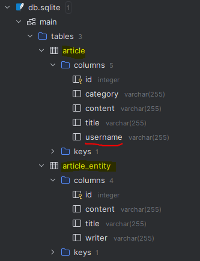

# JPA ( Java Persistence API )

## JPA
- 데이터가 어떻게 테이블에 MAPPING 되는 지 명세하기 위해서 !
- interface 와 annotation 으로 구성
- SQL 문이 아닌 Java 를 활용해 DB 이용 !!
```java 
// 이 클래스가 DB 상의 어떤 테이블을 나타내는 클래스임을 알려주는 annotation
@Entity
public class Student() {}
```

## Hibernate
- JPA 명세를 바탕으로 작동하는 ORM 프레임워크
- JPA 로 표현된 객체를 실제 DB에 적용 및 사용

### build.gradle 에 추가하기
```
//sqlite
	runtimeOnly('org.xerial:sqlite-jdbc:3.41.2.2')
	runtimeOnly('org.hibernate.orm:hibernate-community-dialects:6.2.4.Final')
```

### application.yaml
```
# JPA도 어떤 DB를 사용할 지가 설정되어야 한다.
spring:
  datasource:
    url: jdbc:sqlite:db.sqlite
    driver-class-name: org.sqlite.JDBC
    # username: sa
    # password : password
  jpa:
    hibernate:
      ddl-auto: create
    show-sql: true
    database-platform: org.hibernate.community.dialect.SQLiteDialect


```

### ArticleEntity.java
```java
/*
CREATE TABLE article (
    id INTEGER PRIMARY KEY AUTOINCREMENT, -- Long
    title TEXT,     --String
    content TEXT,   --String
);
 */
```
- 이 SQL 문을 @Entity 를 사용해 아래와 같이 만들 수 있다 .
```java

@Entity // 이 클래스가 DB 상의 어떤 테이블을 나타내는 클래스임을 알려주는 annotation
public class ArticleEntity {
    @Id // 이 속성(필드)가 테이블의 PK(Identity)컬럼임을 나타내는 annotation
    // 이 속성의 컬럼 데이터는 DB에서 자동으로 부여하는 값 및 어떻게 부여할지를 정의하는 annotation
    // 쉽게 말해 AUTOINCREMENT다 ~ 라는 뜻
    @GeneratedValue(strategy = GenerationType.IDENTITY)
    private Long id;
    private String title;
    private String content;
    private String writer;
}

```

## Annoatation
### @Table , @Column
```java
@Table(name="article")
public class ArticleEntity {

}
```
```java
@Column(name="username")
private String writer;
```



- article_entity 가 article 테이블 명이 변경된 것을 확인할 수 있다.
- writer 가 username 컬럼 명이 변경된 것을 확인할 수 있다.