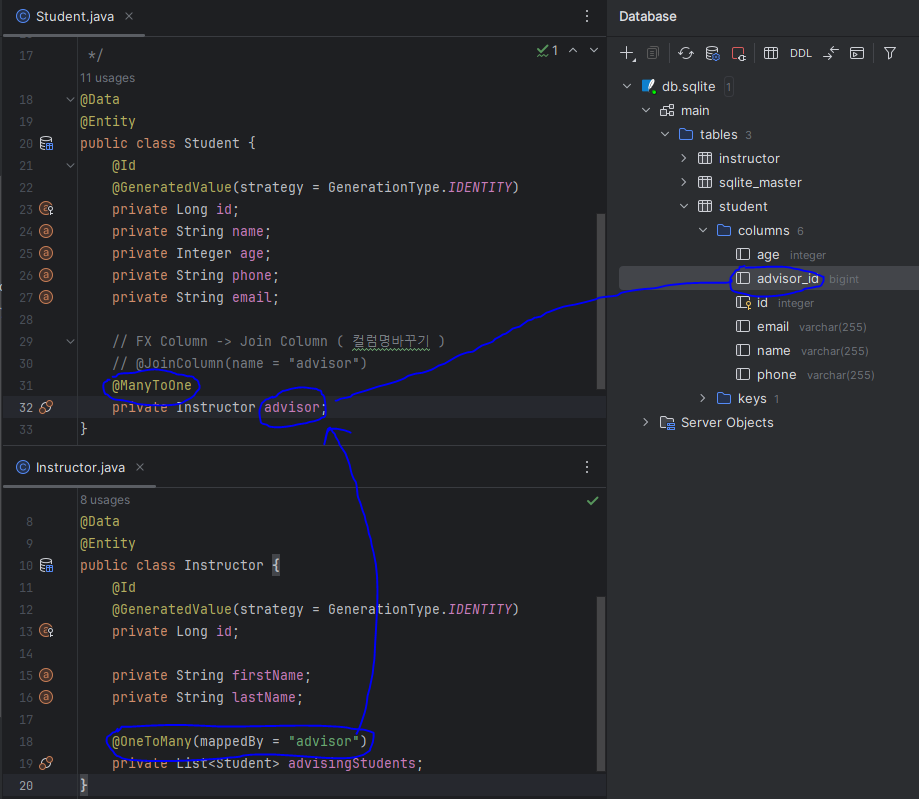

# ManyToOne & OneToMany

## Many To One
- 내가 N이고 쟤가 1일 때
- 나한테 @ManyToOne @annotation 사용

## One To Many
- 내가 1인데 나와 관련된게 N일때
- 나한테 @OneToMany @annotation 사용

- Student 는 학생 한 명당 교수 하나 이기 때문에 `Many To One`
- Instructor 은 나 하나 당 학생이 여러명 이기 때문에 `One To Many`
- `OneToMany(mappedBy = "advisor")` 여기서 advisor 은 Student의 advisor 에 할당된다.
- DB를 보면 student에 advisor_id 컬럼이 생긴 것을 확인 할 수 있다.