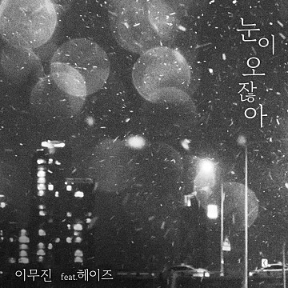

# 눈이 오잖아 (Feat. 헤이즈)
  
  
 

아티스트 [이무진](https://search.naver.com/search.naver?where=nexearch&sm=tab_etc&pkid=1&os=17503517&qvt=0&query=%EC%9D%B4%EB%AC%B4%EC%A7%84)  
앨범 [눈이 오잖아(Feat.헤이즈)](https://search.naver.com/search.naver?where=nexearch&sm=top_hty&fbm=0&ie=utf8&query=%EB%88%88%EC%9D%B4+%EC%98%A4%EC%9E%96%EC%95%84+)  
발매 2021.12.03  
장르 발라드(국내)  
작곡 [이무진](https://search.naver.com/search.naver?where=nexearch&sm=tab_etc&pkid=1&os=17503517&qvt=0&query=%EC%9D%B4%EB%AC%B4%EC%A7%84), [교교(gyogyo)](https://search.naver.com/search.naver?where=nexearch&sm=tab_etc&qvt=0&query=%EA%B5%90%EA%B5%90(gyogyo))  
작사 [이무진](https://search.naver.com/search.naver?where=nexearch&sm=tab_etc&pkid=1&os=17503517&qvt=0&query=%EC%9D%B4%EB%AC%B4%EC%A7%84), [교교(gyogyo)](https://search.naver.com/search.naver?where=nexearch&sm=tab_etc&qvt=0&query=%EA%B5%90%EA%B5%90(gyogyo))   
편곡 [이단옆차기](https://search.naver.com/search.naver?where=nexearch&sm=tab_etc&qvt=0&query=%EC%9D%B4%EB%8B%A8%EC%98%86%EC%B0%A8%EA%B8%B0), [EastWest](https://search.naver.com/search.naver?where=nexearch&sm=tab_etc&qvt=0&query=EastWest), [이무진](https://search.naver.com/search.naver?where=nexearch&sm=tab_etc&pkid=1&os=17503517&qvt=0&query=%EC%9D%B4%EB%AC%B4%EC%A7%84), [교교(gyogyo)](https://search.naver.com/search.naver?where=nexearch&sm=tab_etc&qvt=0&query=%EA%B5%90%EA%B5%90(gyogyo)) 

## 가사 정보

한 달 좀 덜 된 기억들  
주머니에 넣은 채  
걷고 있어 몇 시간을  
혹시 몰라 네가 좋아했던  
코트를 입은 채    
나온 번화가 그때 마침  
찬바람 막아줄  
네가 이젠 없으니까  
추울 때 따스히  
안아줄 이가 없으니까  
친구들이 불러도  
나갈 수 없어 난  
창문 너머  
그저 바라봐 그때 마침  
눈이 오잖아  
우리 처음 만난 그 밤에도  
한참 동안 눈이 왔잖아  
지금 내가 생각나지  
않을 리가 없잖아  
눈이 오잖아  
그때 내가 밤하늘 내린  
하얀 눈 예쁘다 했잖아  
그랬잖아  
지금 눈이 오잖아  
Uh 눈이 오잖아  
이 말 핑계인 걸 알지만  
생각에 잠기곤 해  
거릴 거니는 내  
곁에 아무도 없을 때  
더 크게 들리네  
Oh 눈 내리는 소리  
이제 인정하자  
수많은 끝도 끝났어  
찬란한 그때  
우린 이젠 없으니까  
돌아온 계절  
남아있는 건 없으니까  
추억을 지우는 게    
내 이별의 숙제  
창문 너머  
그저 바라봐 그때 마침  
눈이 오잖아  
우리 처음 만난 그 밤에도  
한참 동안 눈이 왔잖아  
지금 내가 생각나지  
않을 리가 없잖아  
눈이 오잖아  
그때 내가 밤하늘 내린  
하얀 눈 예쁘다 했잖아  
그랬잖아  
지금 눈이 오잖아  
마지막 안녕이 남은 거리에서 혼자  
너와의 약속들을 되뇌었어  
함께여야 할 너 없는 이 겨울의  
첫눈이 오잖아  
눈이 오지만  
우리 처음 만난 그 밤에도  
내렸던 그 눈이 오지만  
주머니 속 챙겨 나온 기억  
버려야만 해  
눈이 오지만  
우린 이대로의 모습으로  
남아있는 게 맞지만  
그래도  
지금  
그 눈이 오잖아

