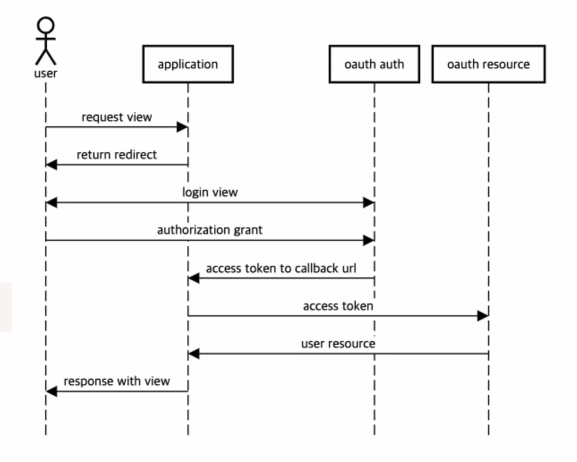

# OAuth2 ( Open Authorization )
- 다른 서비스의 사용자 정보를 안전하게 위임받기 위한 표준
- 로그인을 **대신 해주는 기술이 아 니 다 !**
- 사용자가 어떤 서비스에 소셜 로그인을 진행하고 싶을 때 해당 서비스에 직접 인증 정보를 주지 않아도 나의 정보를 조회할 수 있도록 권한을 위임하는 기술

1. 사용자가 로그인 필요한 서비스 요청
2. 사용자가 소셜 로그인 선택
3. 소셜 로그인 화면으로 redirect
4. 소셜 서비스 제공자 화면으로 이동
5. 인증 정보 제공 , Access Token 첨부해 본래 서비스로 이동
6. Access Token을 이용해 사용자 정보 조회
7. 접속 요청 사용자의 정보를 바탕으로 인증