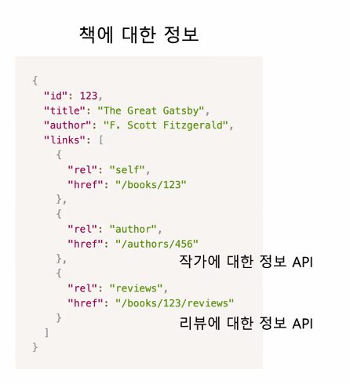

# REST

### REpresentational State Transfer ( 표현 상태 전달 )
- HTTP 를 이용한 서버를 구현할 때 지켜야 하는 설계 원칙
- 서버와 클라이언트 사이의 결합성 감소에 목표를 둠
  - 성능 향상
  - 확장성 확보
  - 사용 편의성 증대

### Client - Server Architecture
- 클라이언트와 서버의 역할 분리
- 서버는 데이터가 어떤 방식으로 표현되는 지 몰라도 된다.
- 클라이언트도 데이터가 어떻게 저장되는 지 몰라도 된다.
- **양측의 독립적 발전 추구**

### Statelessness ( 상태를 저장하지 않는다 )
- 클라이언트가 보내는 개별적인 요청은 각각이 요청을 표현하기 충분해야 한다.
- 즉, 서버가 클라이언트가 몇번째 보낸 요청인 지 , 이전에 보낸 요청에 데이터가 어떤 지 기억할 필요가 없어야 한다.


### Cacheability
- 서버에서 보내주는 응답은 캐시 가능성에 대해 표현해줘야 한다.
- Cache-Control Header

### Layered System
- 클라이언트가 서버에 요청이 도달하기까지의 과정을 알 필요 없고, 영향 받지도 않아야 한다.

### Uniform Interface
- 일관된 인터페이스를 가지고 있어야 한다.
- REST에서 가장 근본적인 제약사항
- RESTful API 가 가지는 인터페이스를 묘사한 제약사항
- 서버에 요청하는 자원이 요청 자체로 식별이 되어야 한다.
  - 클라이언트가 어떤 자원을 요구하는 지가 요청 자체에 드러나야 한다.
  - 즉, URL에 요구하는 자원이 무엇인지 명확히 표현되어야 한다.
  - ```
      // 학생들 중 ID가 studentId인 자원에 대한 요청
      GET/students/{studentId}
    ```
- 자원에 대해 조작할 때, 그 자원의 상태나 표현으로 조작이 가능해야 한다.
  - 자원에 대해 메세지를 주고받을 때, JSON 과 같은 형태로 데이터를 표현한다.
  - 서버가 데이터를 어떻게 관리하는 지 보다 **표현 자체**에 더 중점을 둔다.
  - ```json
     {
        "name" : "yujin",
        "age" : 25,
        "isStudent" : true
    }
    ```
    
- 각 요청과 응답은 자기 자신을 해석하기 위한 충분한 정보를 포함해야 한다.
  - 즉 , JSON 형태로 데이터를 보냈다면 , 해당 내용이 요청에 명시되어야 한다.
  - Content-Type 헤더를 주로 사용
  - ```
    Content-Type: application/json
    ```
    
- HAETOAS ( Hypermedia As The Engine Of Application State )
  - 잘 구현된 REST는 , 최초의 URL 에 접근했을 때, 이후 서버가 제공하는 모든 정보에 도달할 수 있는 방법을 알 수 있어야 한다.
  - 주소를 입력해 페이지로 이동한 뒤, 그 내부의 링크를 이용해 사이트를 활용하는 개념
  - 
  