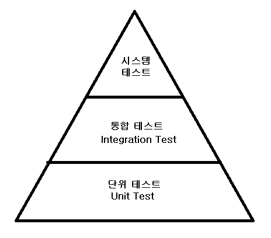

### Postman 을 이용한 테스트
Application은 많은 부분으로 나누어져 있다.
- Controller : 요청을 받아서 service 전달
- Service : 인자를 Repository 전달
- Repository : 인자를 받고 DB 조작

# 소프트웨어 개발의 테스트

- 시스템 테스트 : 통합되어 구축된 시스템을 테스트 하는 단계
- 통합 테스트 : 서로 다른 모듈이 상호작용 하는 것을 테스트 하는 단계
- 단위 테스트 : 개별 코드 단위(주로 메소드)를 테스트 하는 단계

테스트 코드의 단점
- 결국 코드를 작성하는 것이고 , 개발 시간이 늘어난다.
- 테스트 코드도 유지보수가 필요해 비용이 늘어난다.
- 테스트 작성법을 따로 배워야 한다.

테스트 코드의 장점
- 잘못된 방향의 개발을 막는다 (이전에 작동하던 기능이 작동하지 않는 상황 등)
- 전체적 코드 품질이 상승된다.
- 최종적으로 오류 상황에 대한 대처가 좋아져 전체적인 개발 시간이 줄어들기 시작한다.

