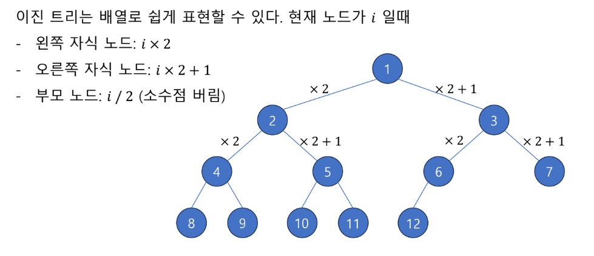
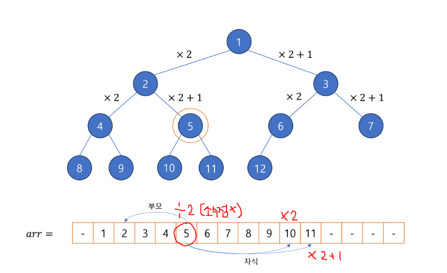
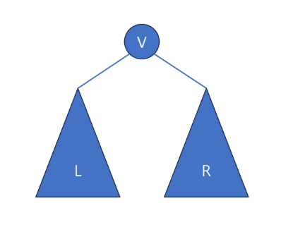

# Tree

  
# TREE 
원소들 간에 1:N 관계를 가지는 비선형 자료구조   
상위 원소 / 하위 원소의 관계가 있는 계층적 자료구조  

### 정의
한 개 이상의 노드로 이루어진 유한 집합  
* 각각 데이터를 담고 있는 원소를 "노드" 또는 "정점" 이라 한다.
* 노드 중 취상위 노드를 "ROOT 노드" 라 한다.
* 각 노드는 0개 이상 ( 자식이 없는 노드 가능 ) 의 자식 노드를 가질 수 있다.
* 하나의 부모에 여러 자식 연결 되어 있다.
* 하나의 자식은 둘 이상의 부모를 가질 수 없다.
* 노드의 갯수가 N개 일 때, N-1 개의 간선을 가지고 있다. 그래서 순한 구조가 생기지 않는다.


* 리프 노드 : 더 이상의 자식이 없는 노드 (마지막 노드)
* 차수 (Degree) : 노드에 연결된 자식 노드의 수
* 트리의 차수 : 트리 노드들의 차수 중 제일 큰 값
* 높이 (Level) : 루트에서 노드에 이르는 간선의 수 
* 트리의 높이 : 노드 중 높이가 가장 큰 값

### TREE , GRAPH의 차이점
" 순환 구조 "  
* Tree : 순한 구조 X ( 싸이클을 만들지 않는다. )
* GRAPH : 순환 구조 O


# 이진 트리 - Binary Tree
트리 중 모든 부모 노드가 **최대 2개**의 자식 노드를 가진 트리  


## 포화 이진 트리 - Perfect Binary Tree


## 완전 이진 트리 - Complete Binary Tree
제일 깊은 레벨을 제외한 레벨에 노드의 갯수가 최대로 차있으며,  
마지막 레벨에 노다가 존재할 경우 **왼쪽부터 차례대로** 채워 넣어진 이진 트리  


## 편향 이진 트리 - Skewed Binary Tree
높이가 H일 때 이진 트리가 가질 수 있는 **최소의 노드 갯수**를 가지며,  
한쪽 방향의 자식 노드만 가진 이진 트리  


## 이진 트리 배열로 표현하기
  



## 이진 트리 순회 
이진 트리의 각 노드를 한번씩만 방문하는 체계적인 방법  

- 루트 노드(V), 왼쪽 서브트리 (L), 오른쪽 서브트리(R) 를 정해진 순서대로 
- **전위 순회 (VLR)**
  - 루트 노드 -> 왼쪽 서브트리 -> 오른쪽 서브트리
- **중위 순회 (LVR)**
    - 왼쪽 서브트리 -> 루트 노드 -> 오른쪽 서브트리
- **후위 순회 (LRV)**
    - 왼쪽 서브트리 -> 오른쪽 서브트리 -> 루트 노드

## TreeArray
```java
    // 총 노드의 갯수
    private int nodes;

    // 실제 트리를 담고있는 배열
    private int[] arr;

    // 배열을 담는다.
    public void setArr(int[] arr) {
        this.arr = arr;
        this.nodes = arr.length;
```  

### 전위순회 (VLR)
```java
// node: 현재 트리의 루트 노드 index
public void traversePreorder(int node) {
    // node가 배열을 벗어나지 않고,
    // 데이터가 저장되어 있다 (0이 아니다)
    if (node < nodes && arr[node] != 0) {
        // V 방문
        System.out.print(arr[node] + ", ");
        // L 방문
        this.traversePreorder(node * 2);
        // R 방문
        this.traversePreorder(node * 2 + 1);
    }
}
```

### 중위순회 (LVR)
```java
public void traverseInorder(int node) {
        if (node < nodes && arr[node] != 0) {
          // L 방문
          this.traverseInorder(node * 2);
          // V 방문
          System.out.print(arr[node] + ", ");
          // R 방문
          this.traverseInorder(node * 2 + 1);
        }
}
```

### 후위순회 (LRV)
```java
public void traversePostorder(int node) {
    if (node < nodes && arr[node] != 0) {
        // L 방문
        this.traversePostorder(node * 2);
        // R 방문
        this.traversePostorder(node * 2 + 1);
        // V 방문
        System.out.print(arr[node] + ", ");
    }
}
```

### 결과
```java
public static void main(String[] args) {
        TreeArray tree = new TreeArray();
        tree.setArr(new int[]{
                0, 1, 2, 3, 4, 5, 6, 7, 8, 9, 10, 11, 12, 13, 14, 15
        });
        // 트리의 루트 노드는 1이다
        tree.traversePreorder(1);
        System.out.println();
        tree.traverseInorder(1);
        System.out.println();
        tree.traversePostorder(1);
}
        // 전위순회
        1, 2, 4, 8, 9, 5, 10, 11, 3, 6, 12, 13, 7, 14, 15
        // 중위순회
        8, 4, 9, 2, 10, 5, 11, 1, 12, 6, 13, 3, 14, 7, 15
        // 후우순회
        8, 9, 4, 10, 11, 5, 2, 12, 13, 6, 14, 15, 7, 3, 1

```