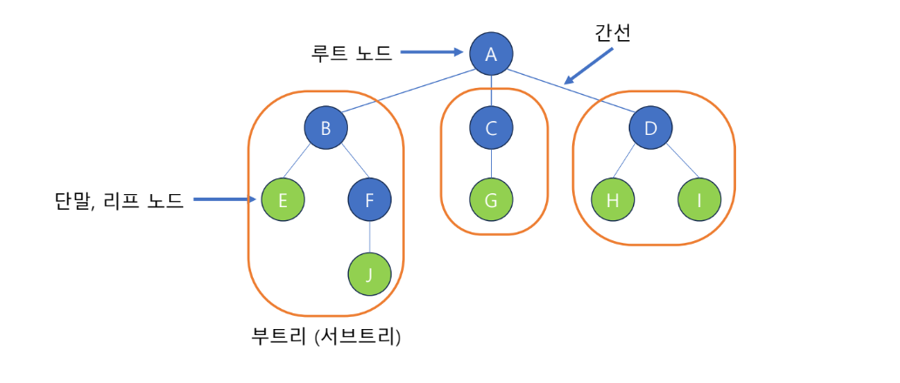
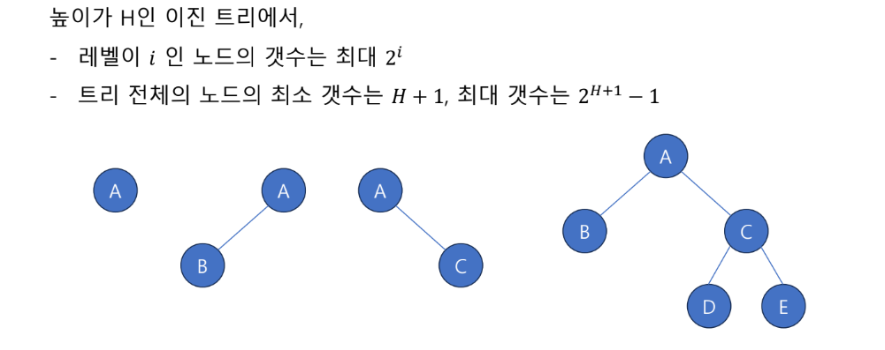
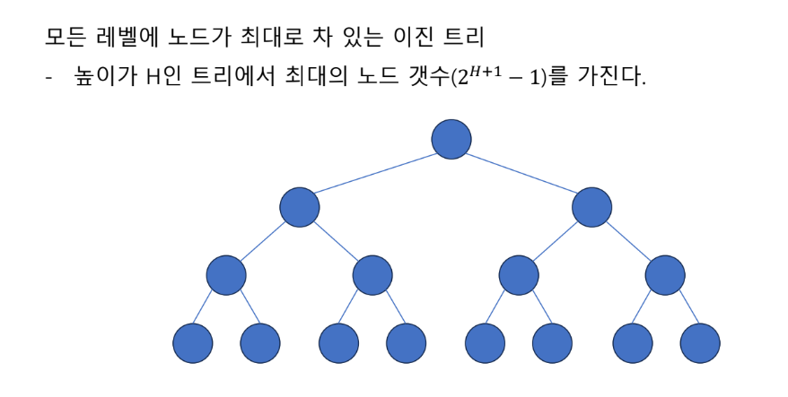
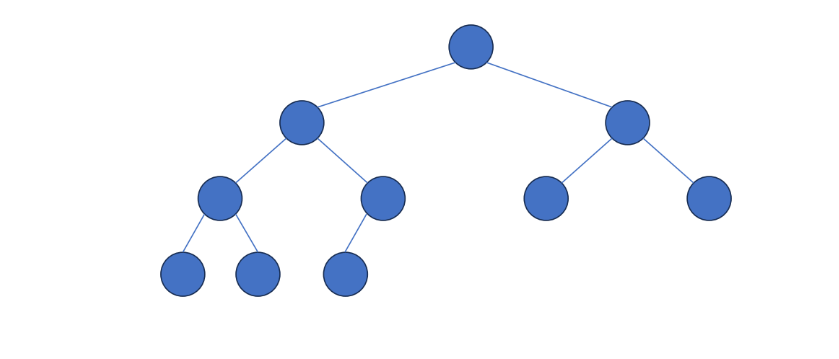
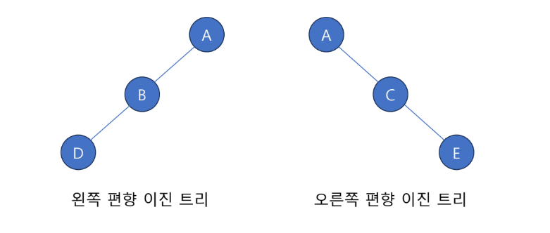

# Tree

  
# TREE 
원소들 간에 1:N 관계를 가지는 비선형 자료구조   
상위 원소 / 하위 원소의 관계가 있는 계층적 자료구조  

### 정의
한 개 이상의 노드로 이루어진 유한 집합  
* 각각 데이터를 담고 있는 원소를 "노드" 또는 "정점" 이라 한다.
* 노드 중 취상위 노드를 "ROOT 노드" 라 한다.
* 각 노드는 0개 이상 ( 자식이 없는 노드 가능 ) 의 자식 노드를 가질 수 있다.
* 하나의 부모에 여러 자식 연결 되어 있다.
* 하나의 자식은 둘 이상의 부모를 가질 수 없다.
* 노드의 갯수가 N개 일 때, N-1 개의 간선을 가지고 있다. 그래서 순한 구조가 생기지 않는다.

* 리프 노드 : 더 이상의 자식이 없는 노드 (마지막 노드)
* 차수 (Degree) : 노드에 연결된 자식 노드의 수
* 트리의 차수 : 트리 노드들의 차수 중 제일 큰 값
* 높이 (Level) : 루트에서 노드에 이르는 간선의 수 
* 트리의 높이 : 노드 중 높이가 가장 큰 값

### TREE , GRAPH의 차이점
" 순환 구조 "  
* Tree : 순한 구조 X ( 싸이클을 만들지 않는다. )
* GRAPH : 순환 구조 O

# 이진 트리 - Binary Tree
트리 중 모든 부모 노드가 **최대 2개**의 자식 노드를 가진 트리  

## 포화 이진 트리 - Perfect Binary Tree

## 완전 이진 트리 - Complete Binary Tree
제일 깊은 레벨을 제외한 레벨에 노드의 갯수가 최대로 차있으며,  
마지막 레벨에 노다가 존재할 경우 **왼쪽부터 차례대로** 채워 넣어진 이진 트리  

## 편향 이진 트리 - Skewed Binary Tree
높이가 H일 때 이진 트리가 가질 수 있는 **최소의 노드 갯수**를 가지며,  
한쪽 방향의 자식 노드만 가진 이진 트리  

