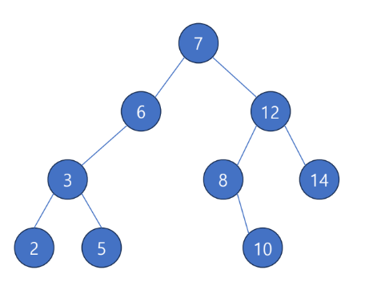
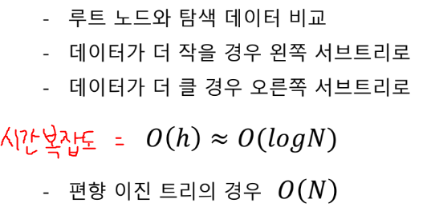

# 이진 탐색 트리 Binary Search Tree

탐색 작업을 효율적으로 하기 위한 자료구조
- 모든 노드의 데이터가 서로 다른 이진 트리
- 어느 노드에게 자식이 있는 경우
  - 왼쪽 자식의 데이터는 부모보다 작다.
  - 오른쪽 자식의 데이터는 부모보타 크다.

  

루트 노드 기준으로
- 왼쪽 서브트리의 모든 데이터 < 루트 노드
- 오른쪽 서브트리의 모든 데이터 > 루트 노드
- 중위 순회 경우, 오름차순 정렬된 데이터 얻을 수 있다.

## 탐색

## 삽입
- 탐색 과정 따라간다.
- 탐색 성공할 경우 삽입 불가
- 탐색 실패할 시점에 새로운 노드로 데이터 추가

## 삭제 
- 삭제할 데이터 가진 노드 탐색
- 삭제할 노드가 단말 노드면 삭제 ( 링크 해제 )
- 삭제할 노드에 자식이 하나일 경우 부모와 대신 연결
- 자식이 두 개일 경우, 
  - 왼쪽 서브트리 값 중 제일 큰 노드
  - 오른쪽 서브트리 값 중 제일 작은 노드 중 하나와 교체
  - 그래야 이진 탐색 트리 조건을 충족시킬 수 있다.