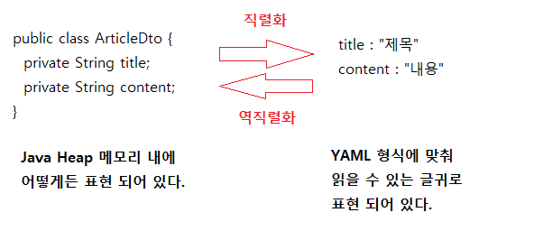
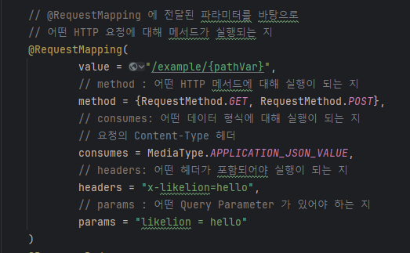

# HTTP
- [Serializtion](#serialization)
- [RequestMapping](#requestmapping)

## Serialization
  

직렬화 : 메모리 상에 저장된 데이터를 전송 가능한 형태로 바꾸는 작업

## JSON
- 데이터를 주고 받는 데 활용할 수 있는 데이터 표현 방식
- JavaScript 객체를 표현하는 방식에서 그 문법을 차용

### yaml
```yaml
title : "제목"
content : "내용"
```
### json
```json
{
  "title" : "제목",
  "content" : "내용"
}
```
- 중괄호 `{}` 내부에 Key-Value 쌍을 콜론 `:` 으로 구분
- Key ( 데이터의 속성 ) 가 객체의 필드라면 , Value ( 데이터의 값 ) 는 필드에 할당된 값
- 기본 자료형 : 문자열 , 숫자 , 불린 , null
- 복합 자료형 : 객체 `{}` , 배열 `[]`


# RequestMapping


