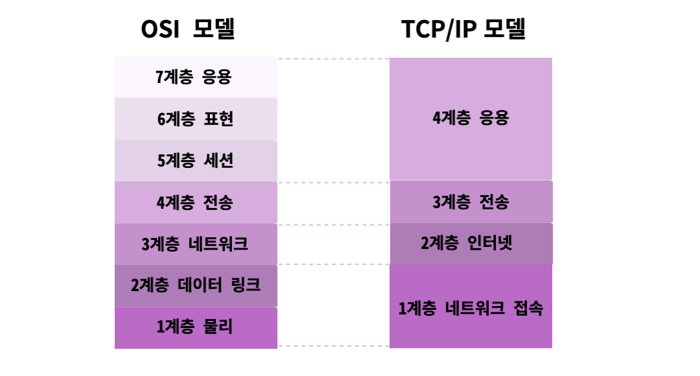

# Web

## OSI & TCP/IP

## OSI
### 1계층 : 물리 계층
전기적 , 기계적 , 물리적 특성을 이용해 데이터 전달하는 역할   

- 케이블 : 전기를 보내 전압차로 0,1 을 전달
- 리피터 : 신호의 조작없이 더 먼 곳에 신호를 전달
- 블루투스 신호

### 2계층 : 데이터 링크 계층
데이터를 전송 받을 수 있는 두 기계(Node) 사이의 연결 계층
- 각 기계 사이의 데이터를 안전하게 전달하는 역할
- 물리 계층의 오류 감지 , 데이터 재전송
- 데이터 전달을 위해 MAC 주소를 사용

### 3계층 : 네트워크 계층
Node , Node 는 연결되어 네트워크를 이룬다
- Node 의 네트워크 내부의 데이터 전송
- 네트워크와 네트워크 사이에 데이터를 어떻게 전송할 지 결정
- 데이터가 너무 크다면 데이터의 크기를 조정하는 역할도 함
- 공유기 (엄청 작은 라우터) , 라우터 (엄청 큰 공유기)

IP (Internet Protocol)   
: 두 컴퓨터 사이에 연결된 노드들을 통해 데이터를 전달하는 방법을 정의하는 규약  

- IP 주소를 통해 네트워크의 컴퓨터를 구분
- **데이터가 온전히 전달되는 지를 보장하진 않는다.**

### 4계층 : 전송 계층
실제로 데이터가 사용자(양쪽 프로세스)가 의도한대로 전송되도록 해주는 계층
- 데이터가 손실이 있었는 지 판단하고
- 손실이 발생하면 다시 보내라고 요청하는 등
- IP 주소를 통해 컴퓨터를 결정하면 , Port 번호를 통해 특정 프로세스를 결정

TCP (Transmission Control Protocol)
- 실제로 전달할 데이터를 쪼개고,
- 쪼개진 데이터가 정상적인지를 판단하기 위한 정보와 함께 패킷의 단위로 보낸다.

### 세션 계층 & 표현 계층
세션 계층
: TCP 를 비롯한 전송 계층 통신의 세션을 관리하는 계층   
- 두 컴퓨터를 연결   
- 연결을 제어   
- 연결을 중단하는 역할

표현 계층
: 전달된 데이터를 사용하는 시스템의 형식에 맞게 변환하는 계층   
- 하위 계층에서 데이터를 정상적으로 전송할 수 있도록   
- 전송받은 데이터를 정상적으로 해석할 수 있도록

### 응용 계층
하위 계층을 통해 전달된 데이터는 컴퓨터(프로세스)가 해석할 수 있는 형태로,
온전히 전달되었을 것을 기대할 수 있다.
- 그 전달된 데이터가 어떤 형태여야 하는 지를 정의하는 계층
- HTTP , SMTP, FTP ...
