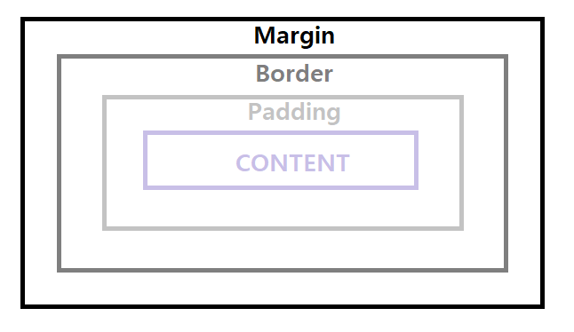

# 문서의 골격

```html
<!DOCTYPE html>
<html>
<head>
    // 한글 인코딩
    <meta charset="UTF-8">
    // 페이지 타이틀 
    <title>정유진의 이력서</title>
</head>
<body>
    <h1>정유진</h1>
    <p>문단을 뜻한다.</p>

<footer>화면 바닥 , 푸터에 들어갈 내용</footer>
</body>
</html>
```

# css 
- css 파일은 <head> 에 추가한다.

```html
//index.html
<head>
    <link rel="stylesheet" href="codelion.css">
</head>
<body>
    <div class="mainBox">
        <p class="big-font">내 이름은 정두콩</p>
        <p class="small-font">코드라이언 배우는 중이지</p>
    </div>
    <footer>css적용된푸터</footer>
</body>
```

```css
// codelion.css

p {
    // 글씨 크기 : 30 픽셀
    font-size: 30px;
}

// 앞에 . 을 붙혀줘야 사용 가능 
.big-font {
    font-size: 40px;
}
   
.small-font {
   font-size: 15px;
}

.mainBox {
    // 테두리 : 두께 방식 색깔
    border: 5px solid black;
    // 폭 크기
    width: 610px;
    // 글자 정렬 : 중앙
    text-align: center;
    // div 가운데 정렬
    margin-left: auto;
    margin-right: auto;
    
}
footer {
    // 글자 정렬 : 중앙
    text-align: center;
    // 배경 색 : 검정
    background-color: black;
    // #숫자문자로도 색 표현 가능
    background-color: #1e1e1e;
    // 글자 색 : 흰색
    color : white;
    // 글자 크기 : 12
    font-size: 12px;
    
}
```

## 박스 쪼개기


- margin : 상자 밖 영역 ( 상자가 옷 입는다고 생각해 !)
- Border : 테두리
- padding : 테두리와 내용물 사이에 있는 빈틈

```html
// box_model.html
<!DOCTYPE html>
<head>
    <meta charset="UTF-8">
    <link rel="stylesheet" href="box_model.css">
</head>
<body>
<div class="box1">박스1</div>
<div class="box2">박스2</div>
</body>
</html>

```
```css
// box_model.css

.box1 {
    background-color: skyblue;
    width: 100px;
    height: 100px;
    border: 5px double black;
    padding: 20px;
    margin: 20px;
    
}

.box2 {
    background-color: violet;
    width: 100px;
    height: 100px
    border: 5px solid purple;
}
```


## 그림자 표현하기
```css
//css 
.mainBox {
    // 0 : X축으로 얼마나 뻗어나가는 지 ( 100 이면 오른쪽으로 그림자 , -100이면 왼쪽으로 그림자)
    // 1px : Y축으로 얼마나 뻗어나가는 지
    // 20px : 그림자의 흐림 정도 ( 블러값 )
    // 0 : 그림자의 퍼짐도 ( 스프레드 )
    // rgba() : RGB 색 조합으로 색 나타내기 / a : 투명도 ( 0이 제일 투명 1이 제일 탁하다)
    box-shadow: 0 1px 20px 0 rgba(0,0,0,0.1);

}
```
